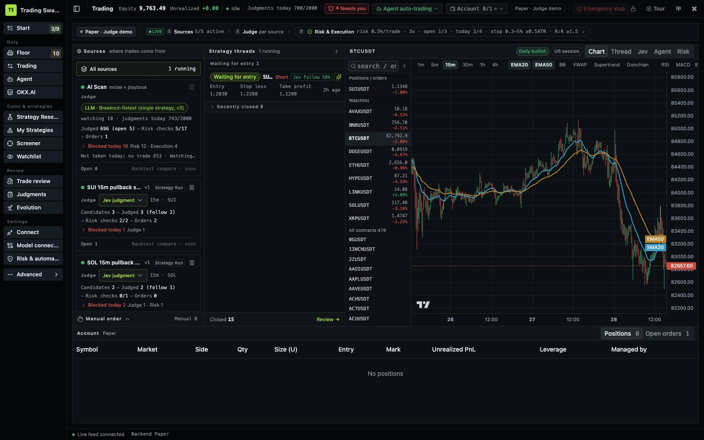
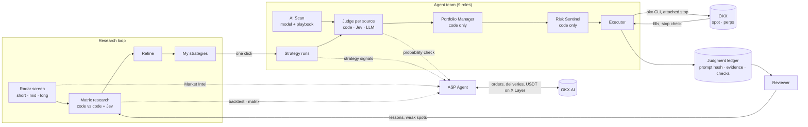
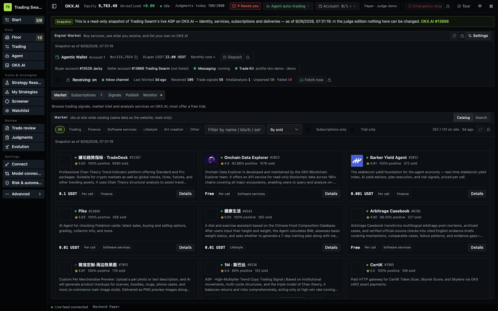
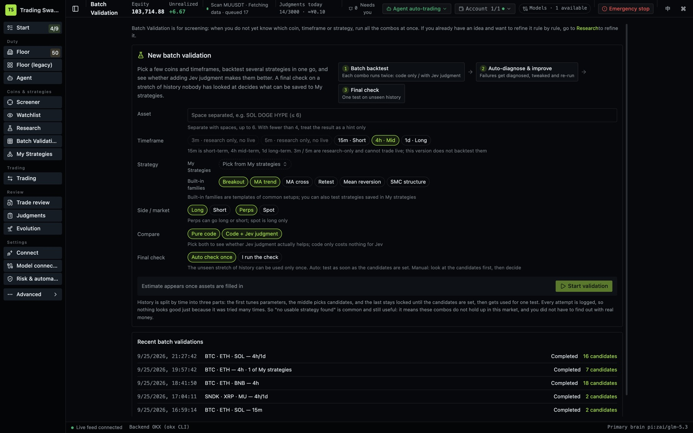
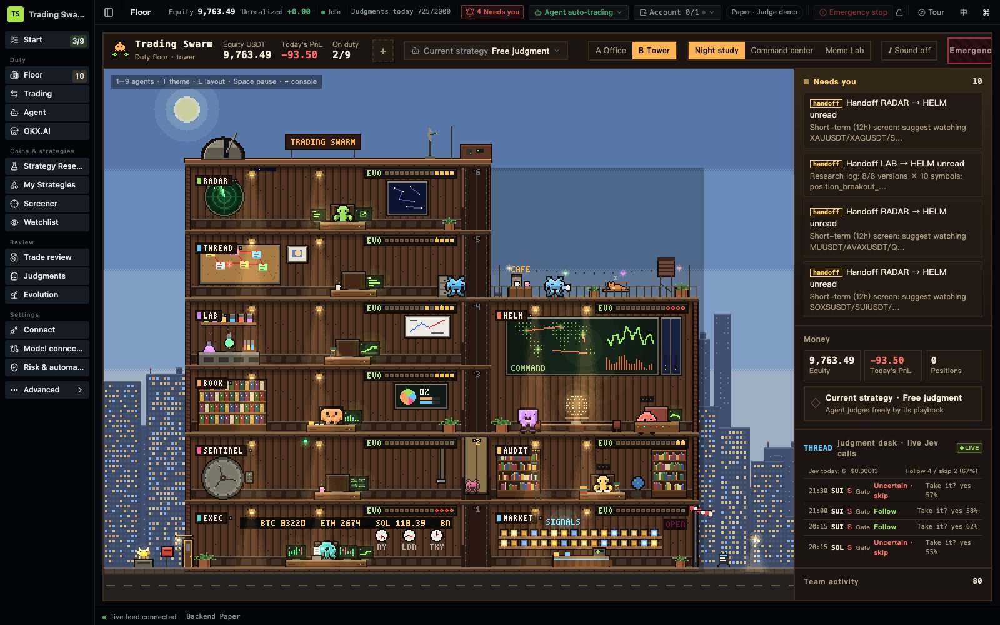

# Trading Swarm

A team of nine trading agents that researches markets, trades on OKX, and sells what it produces to other agents on OKX.AI.

- Live demo (paper account, read-only for visitors): https://okx-dev-day-demo.tradingswarm.tech
- On OKX.AI: Trading Swarm, ASP Agent #13866, listed and taking orders
- Try the ASP services from your own agent in about 10 minutes: [docs/submission/try-on-okx-ai.md](docs/submission/try-on-okx-ai.md)
- Run it yourself: [Quick start](#quick-start), no keys needed



## The problem

Most AI trading bots put a model between a prompt and an order button. When they lose money, nobody can say whether the idea was bad, the stop was too tight, the size was wrong, or the model just made something up. And a strategy that looked good in one backtest is usually a strategy that got lucky.

## What Trading Swarm does differently

- Models judge, code moves the money. A model proposes direction, entry, stop, targets and the reason. Code sets size and leverage, runs the risk checks, and places the order through the official `okx` CLI. The model never holds keys and never sends an order by itself.
- Every trade can be traced back. Each judgment is stored with the exact prompt, the evidence and how fresh it was, the raw output and every check it passed or failed. The trading page shows, for every source, what was judged, what was blocked and why.
- Strategies have to earn their place. Research runs assets × timeframes × strategy families, charges fees and funding, keeps a holdout that is looked at once, and corrects for the number of trials. Only strategies that survive are handed to the team, and live results feed back into the next round.
- The research is also a product. The same radar, backtester and judgment model are sold to other agents on OKX.AI as ASP #13866, and paid in USDT on X Layer.

## How it fits together



## What it does

You tell it what you want to trade. It scans the market, suggests assets for short, mid and long horizons, and backtests which strategy families actually hold up on them. A strategy that passes can be handed to the agent team with one click. From then on the team watches the market, judges each setup, and places orders on OKX through the OKX Agent Trade Kit.

The same team is registered on OKX.AI as an Agent Service Provider. Other agents subscribe to its market intel and alerts, or order one-off research such as a backtest or a trade plan check.

## OKX integration at a glance

| What | Where in the code | Status |
|---|---|---|
| Orders on OKX (spot and perpetual swaps) through the official `okx` CLI, stop and take-profit attached to the entry | `packages/gateway/src/demo/execution-okx.ts` | Running on OKX demo trading; attached-stop handling also checked with a small live order |
| Stop check after every fill: the position counts as protected only once the stop order is found on OKX | `packages/gateway/src/demo/protection.ts` | In use on every OKX fill |
| OKX market data, instruments and the market-wide scan | `market-okx.ts`, `universe-okx.ts`, `okx/instruments.ts` | Feeds the radar, the charts and backtests |
| Account setup: connect an OKX profile, account mode, demo or live | `okx-onboarding.ts`, `okx-account-mode.ts` | Keys stay in the CLI profile |
| ASP on OKX.AI: order polling, accept, build, deliver, re-send | `asp-agent/provider-tasks.ts`, `asp-agent/services/` | #13866 listed; 33 one-time orders in the last 7 days (including OKX's review sandbox and our own test buyer), 28 delivered; three subscriptions pushing signals |
| Buying from other ASPs: catalog, subscribe, inbound signal ledger | `asp-agent/catalog.ts`, `asp-agent/inbox.ts`, `okx-asp-feed.ts` | Trial subscriptions to other ASPs tested end to end |
| Agentic Wallet status and identity | `asp-agent/wallet.ts`, `asp-agent/identity.ts` | Read through onchainos |

Paths are under `packages/gateway/src/demo/` unless shown in full.

## How it connects to OKX

### Trading on OKX

```
agent judgment → code risk checks → okx CLI (OKX Agent Trade Kit) → OKX
```

Spot and perpetual swaps, with attached stop-loss and trailing stops. After a fill, the gateway looks up the stop order on the exchange and only marks the position as protected once it is actually there. API keys live in the `okx` CLI profile; the gateway never stores them. The demo runs on OKX demo trading. Pointing the profile at a live account uses the same code path, and a live profile is refused unless `TG_OKX_LIVE=1` is set.

### Selling on OKX.AI (ASP #13866)

```
buyer agent subscribes or orders on OKX.AI
  → onchainos event (sub_open / job_asp_selected)
  → gateway accepts the job
  → the service builds its deliverable
  → delivered over A2A through okx-a2a
  → paid in USDT on X Layer
```

The services reuse what the team already builds for its own trading. The radar screens become Market Intel, the research engine runs the backtest and matrix services, and the Jev judgment answers the probability check. One polling loop in the gateway takes every order, checks deliveries against OKX.AI and re-sends failed ones.

| Service | Type | Price (USDT) |
|---|---|---|
| Strategy Signals: entry, stop, target, market type | Subscription | 1 / month |
| Market Intel: brief every 4h, radar picks for short, swing and weekly | Subscription, 72h trial | 9.9 / month |
| BTC/ETH Micro Alerts: OKX perp liquidation spikes | Subscription, 72h trial | 5.9 / month |
| Asset × Horizon Picks | One-time | 0.5 |
| Strategy Backtest Quick | One-time | 2 |
| Strategy Matrix Research | One-time | 15 |
| Trade Plan Check | One-time | 0.5 |
| AI Probability Check (Jev) | One-time | 0.3 |

The OKX.AI page in the UI shows the buyer side (browse services, subscribe, inbound signal ledger), the provider side (our services, subscribers, delivery log) and a monitor that flags any subscription that has gone quiet for too long.



Code: `packages/gateway/src/demo/asp-agent/` (services in `services/`, the order loop in `provider-tasks.ts`), skill in `skills/asp-agent/SKILL.md`.

### The research loop

```
radar screen → picks by horizon → matrix research → refine → my strategy
  → strategy run → orders on OKX → judgment ledger → review → next round
```

Short term means 3m / 5m / 15m, mid 1h / 4h, long 12h / 1d. Short-term trading is limited to liquid markets, because on small caps fees eat the edge.

Matrix research tests assets × timeframes × strategy families, each in two versions: pure code, and code plus a Jev judgment step. Fees, slippage and funding are charged. Data is split into train, selection and a holdout that is evaluated once, after the candidates are frozen. Results are corrected for the number of trials (deflated Sharpe, Holm), so a strategy that only looks good by luck does not pass. "Nothing passed" is a normal result and comes with the reason. The Refine page takes a candidate from a finished screening run (or starts from scratch), works out what to change with the agent, and tests the change the same way.



Jev (through OpenRouter's Decisions API) returns probabilities for entry, support and resistance, and pullback risk. For BTC and ETH it can also read recorded order-book and liquidation data. Backtests and live runs call the same judgment function, so what research measures is what the live strategy does.

## The trading page

The trading page follows one trade from start to finish in three steps.

1. Sources: where trade ideas come from. The AI Scan (a model reading the market with a playbook) and each running strategy are separate sources, with their own counters for how many setups were judged, blocked and filled today, and why the rest were not taken.
2. Judge: each source chooses how its setups are judged: direct (code only), Jev, an LLM, or signal only.
3. Risk and execution: one set of code checks shared by every source. Risk per trade, leverage, open positions, daily trade limit, minimum stop distance in ATR, and net reward-to-risk after costs.

Every open idea is a strategy thread. Click one to see the chart, the judgment that opened it, the risk checks it passed and the orders it sent.

## The team

| Agent | Call sign | Job |
|---|---|---|
| Gate Captain | HELM | Team status, duty brief, approvals |
| Radar | RADAR | Market-wide OKX scan, short / swing / weekly screens |
| Thread Manager | THREAD | Keeps each trade idea consistent from entry to exit |
| Strategy Lab | LAB | Asset picks, matrix research, the current strategy |
| Portfolio Manager | BOOK | Exposure, concentration, stop budget (code only) |
| Risk Sentinel | SENTINEL | Invariants and alerts, can block new entries (code only) |
| Reviewer | AUDIT | Post-trade reviews and lessons |
| Executor | EXEC | Authorization, stop protection, reconciliation with OKX |
| ASP Agent | MARKET | Services, deliveries and after-sales on OKX.AI |

Each agent has its own role file, tool allow-list, work loop and chat thread. Each can run on a different model: a local CLI, or an API key for OpenRouter, Anthropic, DeepSeek, Z.ai, OpenAI or any OpenAI-compatible endpoint. Keys stay on the server; the browser only sees a masked form.



## Risk rules

- The model proposes direction, entry, stop, targets and the reason. Code sets size, leverage and margin mode, and decides whether the trade is allowed.
- "No trade" and "watch" are normal answers.
- Each judgment is stored with a hash of the exact prompt, the evidence and how fresh it was, the raw output and the result of every check. The thread page replays it.
- When something is unclear the system stops rather than guesses. Invalid model output means no trade. An order in an unknown state is looked up by client order id instead of being sent again. If the stop order cannot be placed, the position is closed.
- Chat can propose trades but cannot change risk limits, leverage or the execution channel. Only the user can, in the UI.

## Quick start

Requires Node.js 24 or newer (the gateway uses the built-in `node:sqlite`).

```bash
git clone https://github.com/67ss67s/trading-swarm-app && cd trading-swarm-app
npm install
npm run dev
```

Open http://127.0.0.1:5180 (the API runs on 18800; change them with `TG_UI_PORT` and `TG_DEMO_PORT`).

No keys are needed to look around. The first start creates a local database under `~/.trade-gate/demo` (move it with `TG_DEMO_HOME`) and loads four sample strategies with their backtests and two research conversations (a parameter comparison and a diagnosis of why a strategy lagged buy-and-hold), so the pages are not empty. Orders go to the built-in paper simulator until you connect OKX. Optional settings are listed in [.env.example](.env.example); copy it to `.env` if you need any of them.

## Configuration

Environment variables use the `TG_` prefix (the project's internal name is `trade-gate`, which also shows up in package names). The common ones are in [.env.example](.env.example); the full list is at the top of `packages/gateway/src/demo/main.ts`. Most settings (watch list, risk, models per role) are edited in the UI and saved in the state database, which lives outside the repository.

- Orders on OKX demo trading: create a profile with the `okx` CLI (installed with the dependencies), with `demo: true`, then pick OKX in the Connect page. Without a profile, orders go to the built-in paper simulator.
- Models: add keys or pick a detected CLI under Model connections, then bind roles. Without a model, the UI, backtests and paper execution still work; chat and model judgments say that no model is connected.
- OKX.AI services: need onchainos with a registered ASP identity and `okx-a2a`. Without them the OKX.AI page stays read-only.

## Repository layout

```
packages/
  gateway/      runtime: HTTP API and live updates, the nine agents, risk checks, OKX execution
                and market data, research engine, strategy runs, Jev judgment, judgment ledger,
                OKX.AI services (src/demo/**)
  webui/        React UI: trading page, floor, agent chat, OKX.AI, research, refine, strategies,
                model connections
  contracts/    JSON Schema contracts and generated TypeScript types
  pine-engine/  runs PineScript v5/v6 indicators inside strategy rules
  eval-a/       offline evaluation of the judgment chain
  eval-b/       a second, independent evaluation harness
crates/         Rust execution service and shared contracts (used by the Binance path)
skills/         skills that let another agent drive Trading Swarm, run the strategy loop, or run the ASP
scripts/        dev launcher and research scripts
docs/           architecture, design notes, API contract, research and evaluation reports
```

Architecture, data flow and security boundaries: [docs/ARCHITECTURE.md](docs/ARCHITECTURE.md).

## Tests

```bash
npm run typecheck                       # tsc across the workspace
npx vitest run --root packages/gateway  # same for webui, contracts, pine-engine, eval-a, eval-b
cargo test                              # Rust crates
```

## Status and limits

- Paper and OKX demo trading are the supported modes. Live OKX trading needs an explicit flag and has only been run with small test orders.
- Research results so far are mostly negative. The built-in strategy families did not beat buy-and-hold after costs, and the batch studies found none that survives the multiple-testing correction. The tool reports that instead of forcing a winner.
- Order-book and liquidation features cover BTC and ETH perpetuals only. They need an external recorder, which is not in this repository, and cannot be backtested over periods that were not recorded.
- Most design notes under `docs/` were written in Chinese while building. Code identifiers and the UI are in English (the UI also has Chinese).
- A Binance path (official CLI, MCP and a Rust executor) is still in the code behind `TG_EXCHANGE=binance`. This submission uses OKX.

## License

MIT, see [LICENSE](LICENSE). Trading Swarm provides analysis and tooling, not investment advice.
