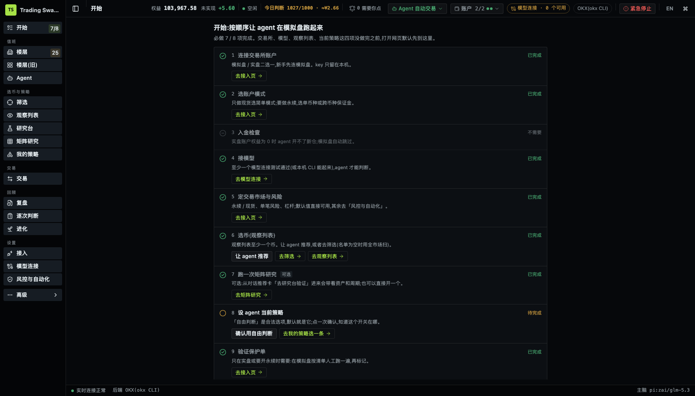
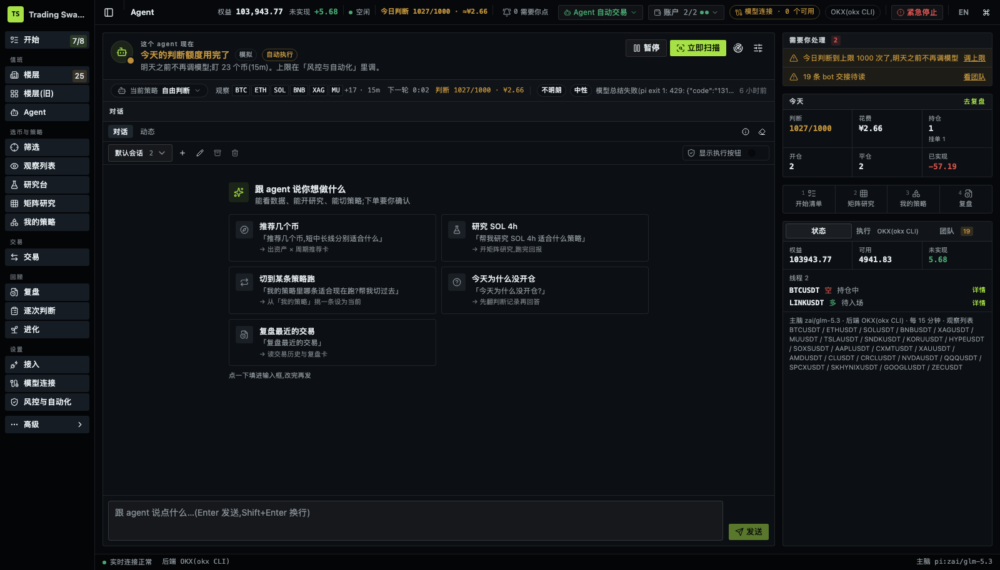
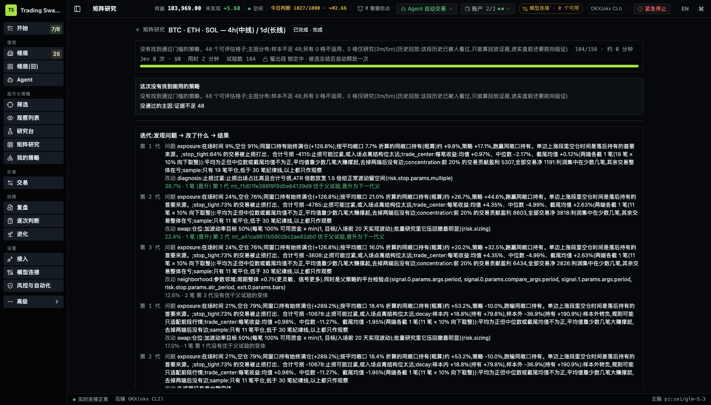
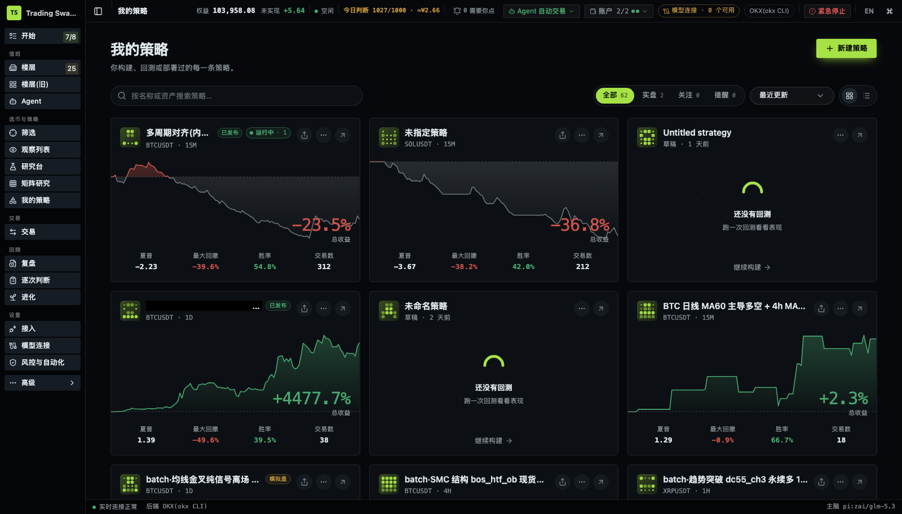
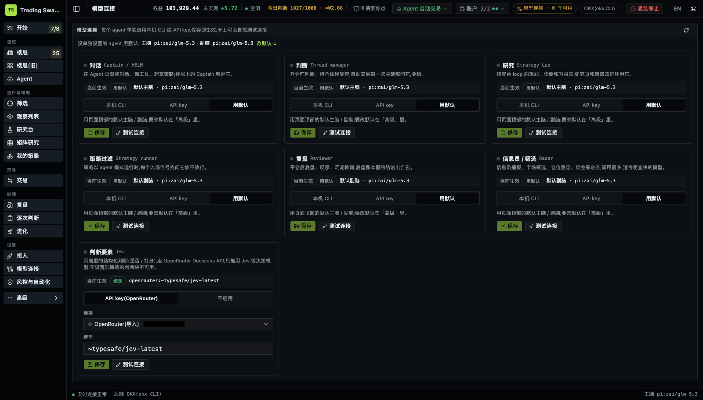
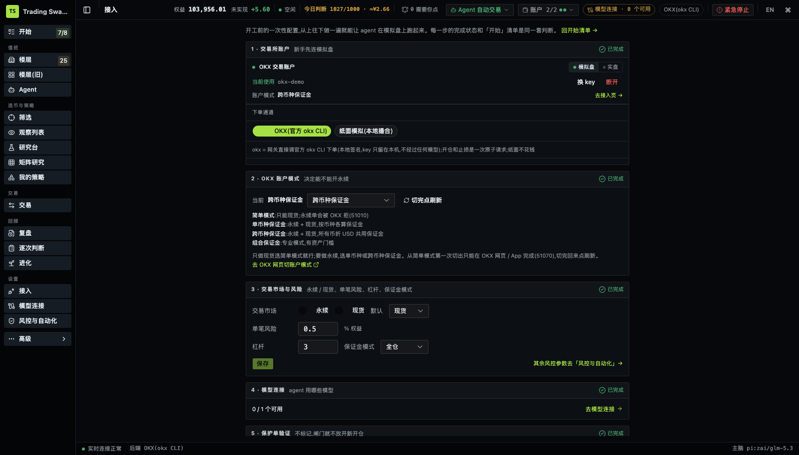
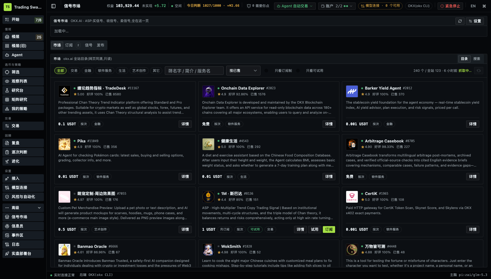
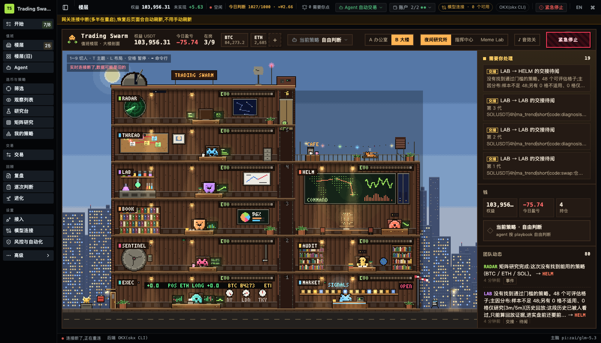

# Trading Swarm

A local trading workbench where a team of agent roles turns "I want to trade BTC and ETH" into a tested strategy and then runs it: recommend assets, run a matrix backtest, save the result as a strategy, and hand it to the agent's roles on paper or OKX demo trading.



Code decides the money (size, leverage, stops, whether a trade is allowed); models decide the judgment calls and explain them. Every model judgment is stored with the exact input it saw, so it can be replayed.

中文简介:Trading Swarm 是本地运行的交易工作台。在对话里说想交易什么,它用代码扫描行情给出短/中/长线推荐,跑「资产 × 周期 × 策略族 × 两臂(纯代码 / 代码 + Jev 判断)」的矩阵回测,留出段只看一次,允许结论是「没找到」;通过的结果存成策略,一键设为 agent 当前策略,按角色分工在纸面或 OKX 模拟盘上运行。

## Contents

- [5-minute trial](#5-minute-trial)
- [What it does](#what-it-does)
- [Architecture](#architecture)
- [Repository layout](#repository-layout)
- [Configuration](#configuration)
- [Development](#development)
- [Status and limits](#status-and-limits)
- [Documentation](#documentation)

## 5-minute trial

Requirements

- Node.js 24 or newer (the gateway uses the built-in `node:sqlite`)
- Optional: the official OKX CLI (`okx`, from `@okx_ai/okx-trade-cli`, installed as a dependency under `node_modules/.bin`) with a demo-trading profile in `~/.okx/config.toml`, if you want orders on OKX demo trading instead of the local paper simulator
- Optional: a model. Either an OpenRouter API key, or a local model CLI such as `pi` or `codex` on your `PATH`. Without any model the UI, backtests and paper execution still work; chat and model-based judgments will report that no model is connected.

Install and start

```bash
git clone https://github.com/67ss67s/trading-swarm-app && cd trading-swarm-app
npm install
cp .env.example .env     # optional; everything in it can stay empty
npm run dev              # same as ./scripts/dev.sh — builds the gateway, starts gateway + UI
```

Open http://127.0.0.1:5180 (API on 18800; change with `TG_UI_PORT` / `TG_DEMO_PORT`).

What to fill in `.env` (all optional)

- `OPENROUTER_API_KEY`: imported once into the gateway's key vault and bound to the "decision" role, which uses the Jev structured-judgment model through OpenRouter. This is what the "code + Jev" arm of the matrix study calls.
- DeepSeek, Anthropic, Z.ai or OpenAI keys are not read from `.env`; add them in the UI under Model connections (they go into the same server-side vault).
- `TG_DEMO_BACKEND=okx` to route orders to OKX demo trading through the `okx` CLI. The default `paper` needs no exchange account.

Suggested click path

1. **Start** (开始): the checklist shows what is configured and what is missing.
2. **Connect** (接入): pick the execution channel (paper, or OKX demo via the CLI), account mode and risk defaults.
3. **Model connections** (模型连接): add an API key or pick a detected CLI, press Test, and bind roles.
4. **Agent**: in the chat, type `我想交易 BTC ETH` ("I want to trade BTC ETH"). The agent calls the recommendation tool and returns a card: each asset × short / mid / long horizon, with the evidence and a suggested strategy family.
5. On the card, choose **去研究台验证** (verify in research). The matrix study opens prefilled with the assets, timeframes and families.
6. **Matrix research** (矩阵研究): start the study and follow its progress. When it finishes, look at the matrix; either a candidate passed the gates or the result says why nothing did.
7. Save a passing candidate as a strategy, then **设为当前策略** (set as current strategy) from **My strategies** (我的策略) or the Agent page header. The agent now runs it by role on the selected channel.

## What it does

**Chat to asset recommendations.** `recommend_assets` is a code tool: market-wide scan, daily regime and a three-horizon radar. The model only picks and explains; numbers on the card come from the tool.



**Matrix research.** A study crosses assets × timeframe tier (short 15m, mid 4h, long 1d) × strategy family (breakout, MA trend, MA cross, pullback, mean reversion, SMC structure) × two arms: pure code, and code plus a Jev judgment step. Fees, slippage and funding are charged. Data is split into train / validation / held-out; the held-out segment is locked until the final candidates are frozen and is evaluated once. "Nothing passed" is a valid result and is reported with the reason (fees, sample size, underperforms buy-and-hold, drawdown).

Rows of the matrix can be built-in families, your own saved strategies, or both: pick strategies from **My strategies** in the study form (or use "test this in matrix research" on a strategy page), and each selected version is run across the chosen assets and timeframes in the same two arms.



**Order-book and liquidation features for the judgment step.** The Jev judgment can read short-horizon microstructure fields for BTC and ETH perpetuals: order-book imbalance within ±0.5% of mid, the largest near-price bid and ask walls, spread, and 5-minute long/short liquidation notional. Live runs and matrix studies read the same recorded frames (gzip JSONL under `TG_MICRO_DIR`), only frames already on disk at the decision time. These fields are marked live-only: without recordings for a period, the judgment reports them as unavailable instead of guessing. The recorder that produces the frames is not part of this repository.

**Strategies run by role.** A saved strategy is an IR plus its judgment questions, asset pool and horizon. Setting it as the agent's current strategy splits it across roles (radar, judge, geometry, risk, holding, execution); each rule is marked as executed by code, by Jev, or by an LLM. "Free judgment" (no strategy) is an explicit option.



**Model connections.** API-key connections (OpenRouter, Anthropic, DeepSeek, Z.ai, OpenAI, any OpenAI-compatible endpoint) and local CLIs (`pi`, `codex`, `claude`) are listed on one page. Each role (chat, judge, research planning, strategy filter, review, utility, decision) can be bound to its own connection and model. Keys stay on the server; the browser only sees a masked form.



**Execution.** Paper (in-process simulator) and OKX demo trading through the official `okx` CLI, which signs locally and holds the keys. A non-demo OKX profile is refused unless `TG_OKX_LIVE=1` is set. A Binance path (official `binance-cli`, Binance MCP through an agent CLI, and a Rust executor) exists behind `TG_EXCHANGE=binance`.



**Signal market (OKX.AI ASP).** Browse and subscribe to OKX.AI Agent Service Provider signal services, see the inbound signal ledger, and publish this agent as a provider. Driven through the `onchainos` / `okx-a2a` CLIs; see `skills/asp-agent/SKILL.md`.

As a provider, the gateway defines seven outward services (`packages/gateway/src/demo/asp-agent/services/`). Orders arrive through one job poller and are dispatched to the handler registered for each `serviceId`; subscription deliveries are fanned out per `serviceId`.

- Market Intel (subscription): a 30-minute market brief plus the short / swing / weekly radar picks.
- BTC/ETH Microstructure Alerts (subscription): liquidation spikes, near-price walls and order-book imbalance, with cooldowns.
- Asset x Horizon Picks (per call): rule-based picks per horizon, with no LLM call.
- Strategy Backtest Quick (per call): an idea compiled to rules and backtested over the full window with fees and slippage.
- Strategy Matrix Research (per call): a matrix study with train / selection / held-out segments and multiple-testing control.
- Trade Plan Check (per call): rule gates on a trade plan, then a Jev probability.
- AI Probability Check (per call): Jev probabilities for a plan. This one is held back from listing until the model provider's resale terms are confirmed.

Listing texts are generated for `onchainos agent update`, but listing and submission are done by a person. The two services that call Jev are off by default and are capped per call.



**Operations floor.** A live view of the team: which role is working on what, hand-offs between roles, and which slice of the current strategy each role holds.



**Guard rails.** Code gates on every proposal (stop side and distance, risk % of equity, notional cap, open-position limits, daily loss stop, stale evidence), a daily model-call cap, a typed-confirmation emergency stop, and reconciliation by `clientOrderId` when an order outcome is unknown.

## Architecture

```
 browser ──HTTP/SSE──▶ webui (Vite + React, :5180) ──/api proxy──▶ gateway (Node 24, :18800, loopback only)
                                                                      │
          ┌────────────────────┬──────────────────┬──────────────────┼──────────────────┬───────────────────┐
     chat + roles        research engine     strategy runner    execution channels   model connections
     (tools, hand-offs)  (matrix study,      (current strategy, (paper │ okx CLI │    (API-key vault,
                          backtest, judge,    role binding)      binance paths)      local CLIs, roles)
                          improve loop)
                                   state: ~/.trading-swarm/…/state.sqlite (+ secrets/, mode 600)
```

Details, data flow and security boundaries: [docs/ARCHITECTURE.md](docs/ARCHITECTURE.md).

## Repository layout

```
packages/
  gateway/      runtime: HTTP API + SSE, chat and role agents, research engine, strategy runner,
                execution channels, model connections, migrations (src/demo/**)
  webui/        React UI (pages: start, connect, agent, matrix study, my strategies, models, floor, …)
  contracts/    JSON Schema contracts and generated TS types
  pine-engine/  PineScript v5/v6 runner used by the research engine
  eval-a/       offline evaluation harness for the judgment chain (implementation A)
  eval-b/       second, independent evaluation harness (implementation B)
crates/
  exec-core/    Rust REST execution core (Binance demo executor `tswarm-demo-exec`)
  execd/        execution service skeleton (single credential holder / account writer)
  exchange-mcp/ MCP OAuth client (PKCE, CIMD) and token store
  contracts-rs/ Rust side of the contracts
skills/         skill files that let an external agent drive the gateway over HTTP
scripts/        dev launcher and research / data scripts
docs/           design notes, runtime contract, research reports, evaluation reports
```

## Configuration

Environment variables use the `TG_` prefix. It is the project's historical prefix and is kept so existing local setups keep working. The common ones are listed in [.env.example](.env.example); the full list is in the header of `packages/gateway/src/demo/main.ts` and in `docs/demo/v3-ui-contract.md`. Most runtime settings (watch list, timeframe, risk, models per role) are edited in the UI and stored in the state database.

State lives outside the repository: `~/.trading-swarm/` by default (`TG_DEMO_DB` to move the database; `TRADING_SWARM_HOME` for the Rust tools). Model keys are stored in `secrets/model-keys.json` next to the database (directory 700, file 600).

## Development

```bash
npm run typecheck            # tsc -b across the workspace
npx vitest run               # inside packages/gateway, packages/webui, packages/contracts, …
cargo test                   # Rust crates
```

See [CONTRIBUTING.md](CONTRIBUTING.md) for boundaries and conventions.

## Status and limits

- Paper and exchange demo trading are the supported modes. Live trading on OKX needs an explicit flag and has only been exercised with small canary orders.
- Research results so far are mostly negative: the built-in strategies did not beat buy-and-hold after costs, and the batch studies found no family that survives multiple-testing correction. The tool reports this rather than forcing a winner.
- Order-book and liquidation features are live-only and cover BTC and ETH perpetuals only. They need an external recorder writing to `TG_MICRO_DIR`, and they cannot be backtested over periods that were not recorded.
- Research scripts under `scripts/trader-*` need the original channel messages and structured signals. These inputs are not distributed with this repository.
- The Binance MCP path depends on Binance's client allow-list; the gateway's own OAuth client is not on it, so that path runs through an agent CLI. Zero-model account reads for that path need an external read bridge (`TG_DIRECT_READ_BIN`). Without it, account reads go through the agent CLI.
- Known failing tests, also failing before this snapshot: in `packages/contracts`, the ajv strict-mode check for the `research-loop` schema; in `packages/eval-a`, one gate-coverage case; in `packages/gateway`, the research routes attribution test. Under full-suite load, a few long research and performance tests (and `generate --check`, which has a 5 s timeout) can time out. They pass when run alone.

## Documentation

- [docs/ARCHITECTURE.md](docs/ARCHITECTURE.md): processes, modules, data flow, security boundaries
- [docs/demo/v3-ui-contract.md](docs/demo/v3-ui-contract.md): HTTP API contract between gateway and UI
- [docs/design/chat-to-strategy-loop-2026-09-25.md](docs/design/chat-to-strategy-loop-2026-09-25.md): chat → research → strategy → run, with acceptance criteria
- [docs/design/okx-atk-2026-09-20.md](docs/design/okx-atk-2026-09-20.md): OKX execution channel
- [docs/design/asp-market-2026-09-20.md](docs/design/asp-market-2026-09-20.md): signal market (OKX.AI ASP)
- [docs/research/](docs/research/): research reports (batch studies, oracle, judgment replay)
- [docs/eval/](docs/eval/): judgment-chain evaluation method and results
