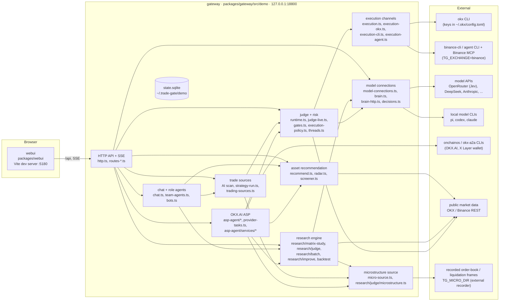

# Architecture

Trading Swarm runs on one machine as two processes: the **gateway** (Node 24, TypeScript), which does all the work, and the
**web UI** (Vite + React), which renders it. Exchange orders go through an external CLI that holds the exchange keys. Model
calls go through an API-key connection or a local model CLI. Runtime state is one SQLite database outside the repository.

The project's internal name is `trade-gate`; it shows up in package names (`@trade-gate/*`), the `TG_` environment prefix
and the state directory `~/.trade-gate/`.

## Processes and modules



| Module | Where | Role |
|---|---|---|
| HTTP API + SSE | `http.ts`, `routes-*.ts` | JSON API for the UI and external agents, server-sent events for live updates |
| Chat and role agents | `chat.ts`, `team-agents.ts`, `bots.ts`, `packages/gateway/agents/*.md` | one chat backend with tools; the nine roles share it with their own role file, tool allow-list and model binding |
| Recommendation | `recommend.ts`, `radar.ts`, `screener.ts` | code-only scan: market-wide tickers, daily regime, short / mid / long radar; the model picks from the result |
| Research engine | `research/**` | matrix study (assets x timeframe x family x arm), backtest with fees and funding, Jev judge, refine loop, Pine runner (`packages/pine-engine`) |
| Trade sources | `strategy-run.ts`, `agent-strategy.ts`, `trading-sources.ts`, `routes-trading.ts` | the AI scan and each running strategy are separate sources; per-source funnel of judged / blocked / filled with reasons |
| Judge and risk | `runtime.ts`, `judge-live.ts`, `gates.ts`, `execution-policy.ts`, `threads.ts` | per-source judgment (direct, Jev, LLM, signal only), shared code checks, strategy threads, order tracking, reviews |
| Execution channels | `execution*.ts` | `paper` (in-process), `okx` (official `okx` CLI), Binance channels behind `TG_EXCHANGE=binance` |
| Model connections | `model-connections.ts`, `brain*.ts`, `decisions.ts` | API-key and CLI connections, per-role binding, key vault, Jev decisions client |
| OKX.AI buyer side | `asp-agent/agent.ts`, `inbox.ts`, `routes-market.ts`, `okx-asp-feed.ts` | browse and subscribe to other ASPs, durable inbound signal ledger |
| OKX.AI provider side | `asp-agent/provider-tasks.ts`, `asp-agent/services/*`, `asp-agent/monitor.ts` | our services on OKX.AI: accept, build, deliver, after-sales; monitor for quiet subscriptions |
| Microstructure | `micro-source.ts`, `research/judge/microstructure.ts`, `research/judge/recordings.ts` | order-book imbalance, walls, spread and 5-minute liquidations for BTC/ETH perps from recorded frames; same source for live runs and backtests |
| Rust crates | `crates/*` | Binance REST executor, execution service skeleton, MCP OAuth client, contracts |

All gateway paths above are relative to `packages/gateway/src/demo/`.

## Data flow: chat to research to a running strategy

1. **Chat.** The user writes what they want to trade. The chat model calls `recommend_assets` (`recommend.ts`). The tool scans
   the market, applies the daily regime and the three-horizon radar (short 3m/5m/15m, mid 1h/4h, long 12h/1d) and a liquidity
   gate for short horizons. The UI renders the result as a recommendation card; numbers come from the tool, not the model.
2. **Matrix study.** "Verify in research" opens a study prefilled from the card (`routes-matrix-study.ts`,
   `research/matrix-study/*`). Rows are built-in strategy families and/or saved strategies. The study evaluates each asset x
   timeframe x row in two arms: pure code, and code plus a Jev judgment step (`research/judge/*`, OpenRouter Decisions API via
   `decisions.ts`). When the judge asks about live-only microstructure fields, it reads only recorded frames that were on
   disk at the decision time; periods without recordings are reported as unavailable. Fees, slippage and funding are charged.
   Data is split into train, validation and held-out; the held-out segment is evaluated once, for the frozen finalists. The
   result can be "no strategy passed", with the reason per cell.
3. **Strategy.** A finalist is adopted as a `ResearchStrategy` version: IR, judge block (questions and thresholds), asset pool,
   horizon and source. Adoption runs a pre-check and is rejected if it has blockers.
4. **Run.** "Set as current strategy" binds it to the agent team. The strategy runner evaluates candidates on bar close with
   the same judge function used in the backtest, then hands proposals to the shared risk checks and to the selected
   execution channel.
5. **Observe.** Every judgment, check result, order event and hand-off is written to the state database and streamed over SSE
   to the UI (trading page, floor, agent pages, history, judgments).

## The trading page: sources, judge, risk and execution

The trading page (`packages/webui/src/pages/trade.tsx`, `components/trade/*`) follows one trade in three layers. The same
layers exist in the gateway, and every "not taken" is recorded with the layer and a reason code.

1. **Sources** (`trading-sources.ts`, `GET /api/trading/sources`). Where trade ideas come from: the AI scan (a model reading
   the market with a playbook) and each running strategy. Each source has its own counters for today (judged, blocked,
   filled) and a ranked list of the reasons setups were blocked or not taken.
2. **Judge.** Each source chooses how its setups are judged: `direct` (code only), `jev` (Jev probabilities against the
   strategy's thresholds, `judge-live.ts`), an LLM, or signal only. Every judgment is stored with a hash of the exact prompt,
   the evidence and its freshness, the raw output and the check results, so it can be replayed on the thread page.
3. **Risk and execution** (`execution-policy.ts`, `gates.ts`, `risk.ts`). One set of code checks shared by every source:
   risk per trade, leverage, open positions, daily trade limit, minimum stop distance (percent or ATR), and net
   reward-to-risk after round-trip costs. The same functions are used by the backtest, the run pre-check and the final check
   right before an order is sent, so the three cannot disagree. Orders that pass go to the selected channel; after a fill the
   gateway looks up the stop order on the exchange before it marks the position as protected.

Every open idea is a strategy thread (`threads.ts`) that links the source, the judgment, the checks and the orders.

## OKX.AI services (ASP)

The gateway is registered on OKX.AI as an Agent Service Provider. Code: `packages/gateway/src/demo/asp-agent/`; the skill
for another agent is `skills/asp-agent/SKILL.md`.

```
buyer subscribes or orders on OKX.AI
  -> onchainos task (sub_open / job_asp_selected)
  -> provider-tasks.ts accepts it (ledger row written before any CLI write)
  -> handler in services/ builds the deliverable
  -> delivered over A2A through okx-a2a, paid in USDT on X Layer
```

- `provider-tasks.ts` is the only job taker. It polls `onchainos agent asp list-tasks`, dispatches by `serviceId` to the
  handler registry, and records every job in `okx_market_provider_task` before it accepts, declines or delivers. A job is
  accepted or declined at most once; a failed or unknown accept is never delivered; an interrupted delivery is not resent
  automatically. A machine-wide lock file makes sure only one gateway per wallet takes jobs.
- `services/` holds the handlers. Subscriptions (strategy signals, market intel brief, BTC/ETH micro alerts) fan out on a
  timer per `serviceId`; one-time services (asset x horizon picks, quick backtest, matrix research, trade plan check, Jev
  probability check) reuse the radar, the research engine and the Jev judgment. A service is only registered after its
  `serviceId` is configured (`PUT /api/asp-services/config`).
- `monitor.ts` flags subscriptions that have gone quiet for too long; `aftersales.ts` handles refunds and disputes by hand.
- The buyer side (`agent.ts`, `inbox.ts`) subscribes to other ASPs and keeps a durable ledger of inbound signals. Inbound
  signals are evidence for the judge; they never open positions on their own.

## Security boundaries

- **Exchange credentials are not held by the gateway.** In OKX mode, orders are signed by the official `okx` CLI with keys in
  its own config (`~/.okx/config.toml`). Binance channels use `binance-cli` profiles, an agent CLI that owns the Binance MCP
  OAuth session, or the Rust executor, which reads `~/.trade-gate/secrets/*.json` (mode 600).
- **Model keys stay server-side.** API keys are stored in `secrets/model-keys.json` next to the state database (directory 700,
  file 600). The model-connection routes accept a key but only ever return `key_masked`; error text is passed through a
  redactor before it is logged or returned (`routes-model-connections.ts`, `model-connections.ts`, `brain-http.ts`).
- **Optional parts degrade instead of failing.** Without an OKX profile the gateway uses the paper simulator. Without a model
  connection, chat and model judgments report that no model is connected. Without `onchainos` / `okx-a2a` the OKX.AI page
  stays read-only. Missing microstructure recordings make the judge report those fields as unavailable.
- **Paid calls are opt-in.** The ASP services that call Jev are off by default and are capped per call (`JUDGE_MAX_CALL_USD`).
  Listing on OKX.AI is done by a person.
- **Loopback only.** The gateway listens on `127.0.0.1` (a non-loopback host needs a bearer token file). Writes are accepted
  only from loopback origins on the configured UI ports (`http.ts`); other origins get 403.
- **Fail-closed behaviour.**
  - Invalid model output means no trade (`NO_TRADE` for a scan, `HOLD` for a review) (`runtime.ts`).
  - A non-demo OKX profile is refused at start unless `TG_OKX_LIVE=1` is set (`execution-okx.ts`).
  - If a role's bound model connection fails, that role reports `model_connection_failed` instead of silently falling back.
  - An unknown order outcome is reconciled by `clientOrderId`, never resent blindly. If the stop order cannot be placed, the
    position is closed.
  - Daily caps on model judgments and on Jev spend (`decision_daily_usd_cap`) stop calls when exhausted.
  - The emergency stop requires a typed confirmation and blocks new entries.
- **Models only propose.** Chat tools that would move money create proposals; quantity, leverage and whether a trade is
  allowed are computed by code (`gates.ts`, `execution-policy.ts`, `risk.ts`). Chat cannot change risk limits, leverage or
  the execution channel.

## State

| Path | Content |
|---|---|
| `~/.trade-gate/demo/state.sqlite` (`TG_DEMO_DB`) | workflow settings, judgments, threads, orders, research runs, strategies, model-connection metadata, OKX.AI ledgers |
| `<db dir>/secrets/model-keys.json` | model API keys (600) |
| `~/.trade-gate/secrets/` | Rust executor credentials and OAuth tokens for the Binance path (600) |
| `~/.okx/config.toml` | OKX CLI profiles (owned by the CLI) |

Schema migrations are in `packages/gateway/src/migrations/` and are applied on start.
