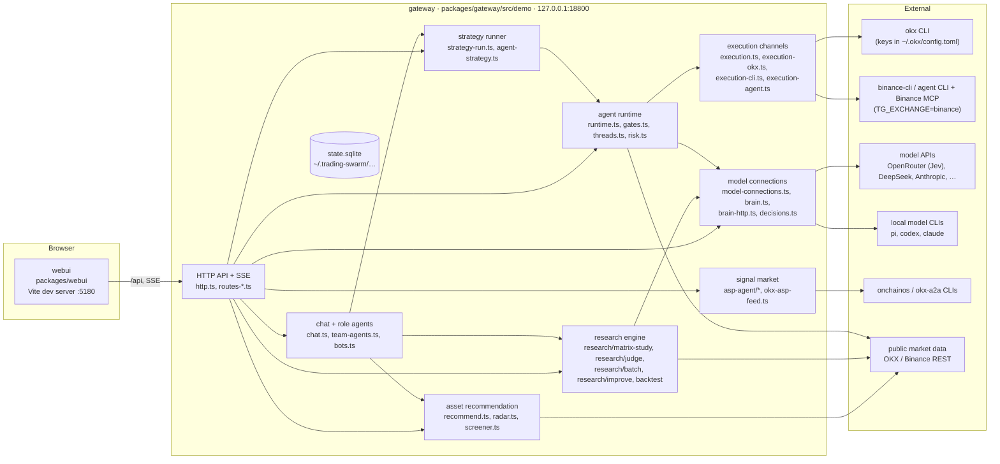

# Architecture

Trading Swarm runs on one machine as two processes: the **gateway** (Node 24, TypeScript), which does all the work, and the
**web UI** (Vite + React), which renders it. Exchange orders go through an external CLI that holds the exchange keys. Model
calls go through an API-key connection or a local model CLI. Runtime state is one SQLite database outside the repository.

## Processes and modules

| Module | Where | Role |
|---|---|---|
| HTTP API + SSE | `http.ts`, `routes-*.ts` | JSON API for the UI and external agents, server-sent events for live updates |
| Chat and role agents | `chat.ts`, `team-agents.ts`, `bots.ts` | one chat backend with tools; roles (chat, judge, research, reviewer, …) share it with different prompts and bindings |
| Recommendation | `recommend.ts`, `radar.ts`, `screener.ts` | code-only scan: market-wide tickers, daily regime, short / mid / long radar; the model picks from the result |
| Research engine | `research/**` | matrix study (assets × timeframe × family × arm), backtest with fees and funding, Jev judge, improvement loop, Pine runner (`packages/pine-engine`) |
| Strategy runner | `strategy-run.ts`, `agent-strategy.ts` | runs the agent's current strategy on each bar close, calls the same `judgeCandidate` as the backtest |
| Agent runtime | `runtime.ts`, `gates.ts`, `threads.ts` | judgments, code gates, strategy threads, order tracking, reviews |
| Execution channels | `execution*.ts` | `paper` (in-process), `okx` (official `okx` CLI), Binance channels behind `TG_EXCHANGE=binance` |
| Model connections | `model-connections.ts`, `brain*.ts`, `decisions.ts` | API-key and CLI connections, per-role binding, key vault, Jev decisions client |
| Signal market | `asp-agent/*`, `okx-asp-feed.ts` | OKX.AI ASP browse / subscribe / publish through the `onchainos` / `okx-a2a` CLIs |
| Rust crates | `crates/*` | Binance REST executor, execution service skeleton, MCP OAuth client, contracts |

## Data flow: chat → research → strategy → run

1. **Chat.** The user writes "我想交易 BTC ETH". The chat model calls `recommend_assets` (`recommend.ts`). The tool scans the
   market, applies the daily regime and the three-horizon radar (short 3m/5m/15m, mid 1h/4h, long 12h/1d) and a liquidity gate
   for short horizons. The UI renders the result as a recommendation card; numbers come from the tool, not the model.
2. **Matrix study.** "Verify in research" opens a study prefilled from the card (`routes-matrix-study.ts`,
   `research/matrix-study/*`). The study evaluates each asset × timeframe × strategy family in two arms:
   pure code, and code plus a Jev judgment step (`research/judge/*`, OpenRouter Decisions API via `decisions.ts`).
   Fees, slippage and funding are charged. Data is split into train, validation and held-out; the held-out segment is only
   evaluated once for the frozen finalists. The result can be "no strategy passed", with the reason per cell.
3. **Strategy.** A finalist is adopted as a `ResearchStrategy` version: IR, judge block (questions and thresholds), asset pool,
   horizon and source. Adoption runs a pre-check and is rejected if it has blockers.
4. **Run.** "Set as current strategy" binds it to the agent. The binding splits the IR into role slices (radar, judge, geometry,
   risk, holding, execution), each marked as executed by code, Jev or an LLM. The strategy runner evaluates candidates on bar
   close with the same judge function used in the backtest, then hands proposals to the runtime's code gates and to the selected
   execution channel.
5. **Observe.** Every judgment, gate result, order event and hand-off is written to the state database and streamed over SSE to
   the UI (agent page, floor, history, judgments).

## Security boundaries

- **Exchange credentials are not held by the gateway.** In OKX mode, orders are signed by the official `okx` CLI with keys in its
  own config (`~/.okx/config.toml`). Binance channels use `binance-cli` profiles, an agent CLI that owns the Binance MCP OAuth
  session, or the Rust executor, which reads `~/.trading-swarm/secrets/*.json` (mode 600).
- **Model keys stay server-side.** API keys are stored in `secrets/model-keys.json` next to the state database (directory 700,
  file 600). The model-connection routes accept a key but only ever return `key_masked`; error text is passed through a
  redactor before it is logged or returned (`routes-model-connections.ts`, `model-connections.ts`, `brain-http.ts`).
- **Loopback only.** The gateway listens on `127.0.0.1`. Writes are accepted only from loopback origins on the configured UI ports
  (`http.ts`); other origins get 403.
- **Fail-closed behaviour.**
  - Two invalid model outputs in a row become `NO_TRADE` (scan) or `HOLD` (review) (`runtime.ts`).
  - A non-demo OKX profile is refused at start unless `TG_OKX_LIVE=1` is set (`execution-okx.ts`).
  - If a role's bound model connection fails, that role reports `model_connection_failed` instead of silently falling back.
  - An unknown order outcome is reconciled by `clientOrderId`, never resent blindly.
  - Daily caps on model judgments and on Jev spend (`decision_daily_usd_cap`) stop calls when exhausted.
  - The emergency stop requires a typed confirmation and blocks new entries.
- **Models only propose.** Chat tools that would move money create proposals; quantity, leverage and whether a trade is allowed
  are computed by code gates (`gates.ts`, `risk.ts`).

## State

| Path | Content |
|---|---|
| `~/.trading-swarm/demo/state.sqlite` (`TG_DEMO_DB`) | workflow settings, judgments, threads, orders, research runs, strategies, model connections metadata |
| `<db dir>/secrets/model-keys.json` | model API keys (600) |
| `~/.trading-swarm/secrets/` (`TRADING_SWARM_HOME`) | Rust executor credentials and OAuth tokens (600) |
| `~/.okx/config.toml` | OKX CLI profiles (owned by the CLI) |

Schema migrations are in `packages/gateway/src/migrations/` and are applied on start.
