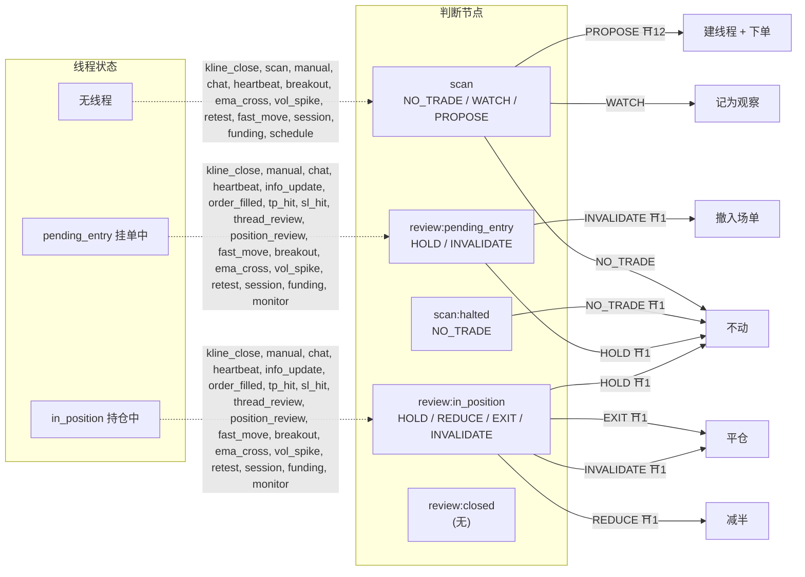

# 判断图(judgment-graph-v1;由 `graph.ts` 生成,不要手改)

## 节点

| 节点 | 允许的 action | 说明 |
|---|---|---|
| scan | NO_TRADE / WATCH / PROPOSE | 本币无线程,判断有没有符合 playbook 的机会 |
| scan:halted | NO_TRADE | 紧急停止中:只能 NO_TRADE(契约要求必须输出一个 action,给显式集合而不是空集) |
| review:pending_entry | HOLD / INVALIDATE | 挂单未成交的线程复查 |
| review:in_position | HOLD / REDUCE / EXIT / INVALIDATE | 持仓中的线程复查 |
| review:closed | (无) | 线程已结束,复查作废 |

## 模型边

| id | 节点 | action | 效果 | 闸 | 说明 |
|---|---|---|---|---|---|
| scan.NO_TRADE | scan | NO_TRADE | none | — | 没有优势,不建线程 |
| scan.WATCH | scan | WATCH | watch | — | 有苗头,记为观察(不建线程) |
| scan.PROPOSE | scan | PROPOSE | open_thread | halt, paused, fresh_evidence, no_position, daily_open_cap, stop_side, stop_distance, tp_side, confidence_floor, thread_limits, no_unknown_orders, preflight | 提议开仓;过全部闸才建线程并下单 |
| halted.NO_TRADE | scan:halted | NO_TRADE | none | halt | 紧急停止中唯一允许的输出 |
| pending.HOLD | review:pending_entry | HOLD | none | thread_still_open | 挂单继续等 |
| pending.INVALIDATE | review:pending_entry | INVALIDATE | cancel_entry | thread_still_open | 论点失效,撤入场单 |
| position.HOLD | review:in_position | HOLD | none | thread_still_open | 论点仍成立,继续持有 |
| position.REDUCE | review:in_position | REDUCE | reduce_half | thread_still_open | 减半 |
| position.EXIT | review:in_position | EXIT | close | thread_still_open | 复查决定离场 |
| position.INVALIDATE | review:in_position | INVALIDATE | close | thread_still_open | 论点失效,平仓 |

## 闸

| id | 界面名 | 说明 |
|---|---|---|
| halt | 紧急停止 | 紧急停止中不允许开仓 |
| paused | 暂停 | 暂停中不开新仓 |
| fresh_evidence | 证据新鲜度 | 开仓判断不能引用 STALE 证据 |
| no_position | 无持仓才能开仓 | 本币已有持仓则不开 |
| daily_open_cap | 每日开仓上限 | 当日开仓次数上限 |
| stop_side | 止损在正确一侧 | 做多止损低于入场、做空高于入场 |
| stop_distance | 止损距离 | 止损距离在 min–max % 之间 |
| tp_side | 止盈在正确一侧 | 止盈方向与持仓方向一致 |
| confidence_floor | 信心下限 | 开仓信心 ≥ 0.40 |
| thread_limits | 线程/日内限制 | 同币已有线程 / 线程数上限 / 日开仓上限 / 日亏停 |
| no_unknown_orders | 没有状态不明的订单 | 有 unknown 意图时不开新仓 |
| preflight | 提交前重闸 | 下单前用最新账户/线程集重查一遍 |
| no_add | 演示版不加仓 | ADD 只记录不执行 |
| thread_still_open | 线程仍开放 | 判断期间线程已结束则整条复查作废 |

## 事件边

| 线程状态 | 事件 | 目标节点 |
|---|---|---|
| none | kline_close, scan, manual, chat, heartbeat, breakout, ema_cross, vol_spike, retest, fast_move, session, funding, schedule | scan |
| pending_entry | kline_close, manual, chat, heartbeat, info_update, order_filled, tp_hit, sl_hit, thread_review, position_review, fast_move, breakout, ema_cross, vol_spike, retest, session, funding, monitor | review:pending_entry |
| in_position | kline_close, manual, chat, heartbeat, info_update, order_filled, tp_hit, sl_hit, thread_review, position_review, fast_move, breakout, ema_cross, vol_spike, retest, session, funding, monitor | review:in_position |
