# Trading Swarm 设计方案 v1 —— 以 Binance MCP Agentic 子账户为底座的 agent-first 交易网关

> 2026-09-02。状态:**设计稿 v1.2。Jacky 已拍板:人工下单走 REST 直连、架构改混合(TS 网关 + Rust 执行服务 + React UI)、主账户/Agentic 子账户双账户联动(§3.5)。新 session(effort max)按 §15 实施。** 上一版的 TradeIntent 单状态机、快照差分对账、进程内单飞锁、三面共用 execute 等已按 review 重写。
> 输入:Jacky 的需求(agent 为主、OpenClaw 式 gate+WebUI+K线、agent 能调 gate 里一切、可接 CLI 也可接模型 API、初始化向导、参考 pi/Hermes 的自动化、借 8794 做得好的部分、**跟单不接入**)+ 调研笔记 `docs/research/*.md`(Binance MCP 探测、OpenClaw/Hermes/pi 机制、8794 功能盘点)+ 前作 `agentic-console-design-v3`(Rust sidecar 设计,工程合同大量继承)+ 独立设计稿(内部评审记录,分歧见 §17)。
> 工作名 **trading-swarm**,CLI `tswarm`,可改。

---

## 0. 一句话

```
一个长驻 Gateway 进程 = 唯一账户写者 + 工具注册表 + 调度器 + WebUI;
模型(API 或 CLI)只通过工具注册表看世界、只通过 intent 提议动钱;
交易所 = Binance MCP Agentic 子账户(OAuth,无本地 key,无提币权);
纯代码做闸、做对账、做钟;交易所真相永远压过模型与本地记忆。
```

与 8794 的关系:**零代码共享、零运行时依赖**。8794 继续跑实盘跟单;trading-swarm 是独立产品、独立账户(Agentic 子账户)、独立仓库。只"抄纪律"(状态派生、闸、对账、单写者、SSE 口径),不抄跟单。

---

## 1. 产品预期

用户视角:打开 WebUI 是一个"会自己盯盘、会写策略、动钱前给你看卡片"的交易台;每天触碰 <10 次;所有自治都是 earned(从只读 → 草稿 → paper → 小额实盘)。

| Workflow | 用户得到什么 | 自治目标 | 阶段 |
|---|---|---|---|
| **W0 对话交易台**(Chat + Chart) | 和 agent 聊持仓/行情/策略,agent 能看 K 线结构、指标、账户真相,能画线、建监控、出交易草稿;UI 上每个按钮 = 同一个工具 | 人主导 | P1 |
| **W2 持仓管理**(Exit DSL) | 止损/追踪/分批止盈全自动,纯代码;异常时 LLM 一句话解释 | 全自动(close=auto) | P1 |
| **W3 找标的**(Discovery) | 纯码漏斗(量能/OI/funding/结构)→ 观察清单进晨报;MonitorSpec"突破再叫我" | 全自动(只产观察项) | P2 |
| **W4 自主交易**(Setup → Proposal) | 候选→研判→提案卡(方向/论点/止损/失效)→ 一键批;earned autonomy 后小额自动 | Draft → Paper → LiveCapped | P2-P3 |
| **W5 复盘/评测** | 每笔平仓自动 journal、校准曲线、周报、教训注入 | 全自动 | P1(只读)→P3 |
| **W6 运维哨兵+预算** | OAuth 失效/MCP 断/时钟漂移/429 → HALT 不烧 token;日 token 预算;每次调用有账 | 全自动 | P1 |
| **W7 策略自研**(新) | agent 在隔离会话里写策略(STRATEGY.md + 规则 DSL)→ 本地 K 线回测 → paper 跑 → 提交"晋升提案"卡;人批后进 W2/W4 的策略库 | 研究全自动,晋升必人批 | P3 |
| ~~W1 跟单~~ | **不接入**(Jacky 明确);将来若要,是一个 signal source 插件,不是核心 | — | — |

明确不承诺:LLM 预测方向赚钱(实证共识:无 alpha);高频;无人看管的大额自治。

---

## 2. 架构决策:TypeScript,不是 Rust
**结论(v1.2,Jacky 拍板):混合架构。TypeScript 做网关、agent harness、调度与控制面;Rust 做唯一的执行服务(所有交易所凭证与账户效果);React 做 UI。** 单仓、两套工具链、一条本机 IPC 边界。

为什么不是纯 TS(v1.1 的结论被推翻的原因):Jacky 决定**人工下单走 REST 直连**(API key 签名,主账户),这条路径恰好是 8794 里被实盘打磨过的东西——`console-core/exchanges/binance.rs`(4574 行:HMAC 签名、服务器时间偏移、进程内令牌桶与 `RestGate::{Ready,Wait,Banned}`)、用户数据流 WS(`account_stream.rs`,断流即 stale)、持仓模式实查 fail-closed、保护腿引擎、多写者检测、`SingleFlightLease` 引擎链。external review 最硬的一条反驳正是"别在没有 testnet 的情况下用未经实战的 TS executor 重写这些"。既然 REST 路径要进来,Rust 执行服务从第一天就值得,而且可以直接从 console-core 抠代码。

为什么不是纯 Rust:产品重心仍是 agent harness——pi-agent-core/pi-ai(OpenClaw 内核,本机已装)、官方 MCP TS SDK(1.30 已支持 Binance 要求的 CIMD OAuth)、WS 控制面、React + lightweight-charts(8794 的 shadcn 前端就是 React)。这些在 Rust 里要重写 pi 三层。

**分工边界(硬规则)**:
| 层 | 语言 | 管什么 | 碰不到什么 |
|---|---|---|---|
| `gateway`(进程 1) | TS | WS/HTTP 控制面、工具注册表三面、agent 会话与大脑、ContextBuilder、调度器(tick/事件/心跳/cron/监控)、K 线库与指标、记忆/技能、向导、事件总线 | **任何交易所凭证**(OAuth token、API key/secret)、交易所网络连接 |
| `execd`(进程 2) | Rust | 唯一持有凭证;两条交易所路径(MCP→Agentic 子账户、REST→主账户);六种执行记录的状态迁移、sizing 与 filters 归一化、下单/撤单/保护腿、对账、账户级写者围栏、用户数据流 WS、划转/提币 | 模型、prompt、调度、UI |
| `webui` | React/TS | 页面、图表、审批卡、向导 | 直接连交易所 |

三条规矩:①同一账户只有 execd 一个进程碰交易所(MCP 与 REST 两条线都在它里面,不存在双写);②契约只有一份——`packages/contracts` 的 JSON Schema(六种执行记录、AccountSnapshot、ExchangePort、ExecutionService RPC),TS 生成类型、Rust 用 `schemars`/`serde` 对拍,CI 里双向 round-trip 测试;③kill test 跨进程做(gateway 死、execd 死、UDS 断、事件循环卡死各一组)。

对 v3 Rust `agent-runtime` crate 的处理不变:契约与 40 条 case 迁移,provider 层由 pi-ai 取代。对 console-core 的处理:**抠代码到 `crates/exec-core`**(exchanges/binance、account_stream、protection、risk 子集、ledger 的订单归属、strategy/strategy_workbench 派生),去掉跟单与信号相关模块;不引用 dev-8793 仓库,复制后独立演进。

## 3. 总架构与进程/包布局
```
  Browser (React WebUI) ── WS/HTTP ──▶ ┌──────────────────────────────────────────────────┐
  tswarm CLI ──────────── WS ────────▶ │ gateway (TS, 进程 1)                               │
  Claude Code / Codex ── MCP(只读) ─▶ │  control plane · tool registry(三面) · MCP server │
                                      │  agent runtime(brains api|cli · pi sessions ·      │
                                      │  context builder · recipes · skills · memory)      │
                                      │  scheduler(tick/event/heartbeat/cron/monitor)      │
                                      │  market(klines sqlite · 公共 REST/WS · 指标)        │
                                      │  policy gates(纯函数,与 execd 同一契约)            │
                                      └───────────────┬──────────────────────────────────┘
                                                      │ UDS JSON-RPC(契约:packages/contracts)
                                                      │ intents / account snapshots / events
                                      ┌───────────────▼──────────────────────────────────┐
                                      │ execd (Rust, 进程 2;唯一凭证持有者、唯一账户写者)   │
                                      │  intents 状态机 · plan 物化 · sizing/filters        │
                                      │  durable 执行队列(优先级/租约/epoch)               │
                                      │  reconciler(clientOrderId · history · fills)      │
                                      │  protection legs · 账户级围栏 · 划转/提币           │
                                      │  ┌─────────────────┐   ┌─────────────────────┐   │
                                      │  │ MCP client+OAuth│   │ REST 签名 + 用户数据 WS │   │
                                      │  │ → Agentic 子账户 │   │ → 主账户(API key)     │   │
                                      │  └────────┬────────┘   └──────────┬──────────┘   │
                                      └───────────┼───────────────────────┼──────────────┘
                                                  ▼                       ▼
                                   agent.binance.com/mcp/agentic     fapi/api.binance.com
```

**包布局(单仓 `trading-swarm/`)**:

| 包 | 语言 | 职责 |
|---|---|---|
| `packages/contracts` | JSON Schema(源)→ TS 类型 + Rust 结构 | Intent / ExecutableOrderPlan / Authorization / ExecutionAttempt / ExchangeOrder / Fill / PositionEffect / AccountSnapshot / Policy / MonitorSpec / ExitDSL / ExecutionService RPC / 事件 |
| `packages/core` | TS,纯函数 | gates、状态派生(借 8794 口径)、指标、结构子集、回测器、paper 撮合 |
| `packages/gateway` | TS | 进程壳、控制面、工具注册表、agent runtime、调度器、market、向导、事件日志、usage/trace;通过 `ExecClient` 调 execd |
| `packages/agent` | TS | brains、pi 会话工厂、ContextBuilder、recipes、skills/memory |
| `packages/webui` | React + Vite + lightweight-charts v5 | 页面;绘图层/调色板从 8794 `frontend-shared` 复制 |
| `packages/cli` | TS | `tswarm onboard|gateway|execd|status|chat|intents|cron|skills|doctor|mcp serve` |
| `crates/execd` | Rust(bin) | 执行服务:UDS JSON-RPC、durable 队列、两条交易所路径、对账、围栏、凭证仓 |
| `crates/exec-core` | Rust(lib) | 从 console-core 抠出的纯执行逻辑:binance REST 适配器、account_stream、protection、risk 子集、ledger 归属、状态派生 |
| `crates/exchange-mcp` | Rust(lib) | MCP client(Streamable HTTP)+ OAuth PKCE/CIMD + tools/list 快照钉版 + 类型化包装 |
| `crates/contracts-rs` | Rust(lib) | 由 `packages/contracts` 生成/对拍的 serde 结构 |

数据目录 `~/.trading-swarm/`:`config.json5`、`state.sqlite`(gateway:events/runs/trace/usage/journal/lessons/monitors/cron)、`exec.sqlite`(execd:intents/attempts/orders/fills/snapshots/leases;**只有 execd 打开**)、`klines.sqlite`、`secrets/`(execd 专属,0600:`oauth-binance.json`、`apikey-main.json`)、`workspace/`、`sessions/`、`logs/`、`run/execd.sock`。

### 3.5 双账户模型:用户管主账户,agent 管 Agentic 子账户

| | 主账户(main) | Agentic 子账户(sub) |
|---|---|---|
| 谁操作 | **用户**(WebUI 手动交易台、CLI) | **agent**(经 intent 图);用户可审批/否决/紧急平 |
| 通道 | REST + 用户数据流 WS,主账户 API key(execd 持有) | MCP + OAuth(execd 持有) |
| 权限 | API key 勾:读 · 现货/合约交易 · **子账户划转** · 提币(可选,IP 白名单)| OAuth scope:market · account · trade;transfer 只限子账户内部 |
| 资金流 | 用户从 WebUI 发起:main → sub 注资、sub → main 回收、main → 外部提币(execd 走主账户 REST 的 sub-account 划转/提币端点)| agent **没有**任何划转/提币工具;Binance 侧也不给 agent 主账户→子账户的权限 |
| agent 看得到什么 | 只读快照(总权益、主账户持仓)作为上下文,**没有**任何主账户写工具 | 全部(经 AccountSnapshot) |
| 单写者 | execd 的 REST 通道(用户手动单也经 execd 的 intent 记录,principal=user,confirm=structured)| execd 的 MCP 通道 |
| 风控 | 用户手动单也过基础闸(filters、持仓模式、限频、紧急停),但不受 agent 的 authority/日频/名义上限约束 | 全套 Gate v2 + authority |
| UI | Trade 页(主账户手动下单)、Portfolio(两账户合并视图)、Funding 页(划转/提币,human 确认 + 2FA 提示) | Chat/Intents/Strategies |

**Binance 侧待 A1 实测的三件事**:①Agentic virtual sub 是否出现在主账户 API 的子账户列表里、`sub-account/universalTransfer` 能否对它划转(官方只说 agent 不能从主账户划入,没说主账户 API key 不能);②子账户本身在 Binance 规则下不能对外提币,所以"提款"= sub → main 回收后从 main 提;③主账户 API key 能否读到 Agentic 子账户的资产(`sub-account/assets`),若能,execd 就多一条独立于 OAuth 的子账户真相来源(对账用,不动钱)。三件事任一不通,Funding 页对应按钮退化为"打开 Binance UI 对应页面"的深链,功能不缺,只是少了一键。

**同一 execd 持有两把凭证的代价**:主账户 API key 的爆炸半径大于子账户 OAuth(它能动主账户的钱)。所以:`secrets/` 只有 execd 进程可读;API key 建议不勾提币(提币走 Binance UI,或勾了必配 IP 白名单);execd 对 main 的写只接受 principal=user 且带 structured confirm 的 intent;agent 会话的 effective catalog 里没有任何 main 写工具,这是 ActorContext 层面的物理隔离,不是 prompt。

## 4. Gateway 控制面(对齐 OpenClaw 的协议形状)

WS 文本帧 JSON:`{type:"req",id,method,params}` / `{type:"res",id,ok,payload|error{code,message,retryable?}}` / `{type:"event",event,payload,seq}`;首帧必须 `connect{client{id,version,mode},scopes[],auth{token}}` → `hello-ok{protocol,snapshot,policy{tickIntervalMs:15000,maxPayload}}`。鉴权 v1 只做 **token(默认)| none(仅回环)**;设备配对与 Tailscale 后移(P3)。scopes:`operator.read` / `operator.write`(发消息、建监控、批 intent)/ `operator.admin`(改 policy/authority/config、OAuth、skills 批准)/ `agent`(内部 brain 通道,不可从外部申请)。副作用方法必须带 `idempotencyKey`。

| 方法族 | 方法 | scope |
|---|---|---|
| chat | `chat.send`(steer/followUp 语义由 `streamingBehavior` 指定)、`chat.history`、`chat.abort`、`chat.steer` | write |
| sessions | `sessions.list/create/describe/patch/fork/compact` | write |
| runs | `runs.list`、`runs.inspect`(trace 回放:context.built→model.called→tool→gate→intent) | read |
| tools | **`tools.catalog`**(带 class/confirmation/scope)、**`tools.invoke`**(UI/CLI 走这条,和模型同一注册表、同一审计) | 按工具 |
| market | `market.symbols/klines/features/structure/subscribe/unsubscribe/backfill` | read |
| account | `account.truth`(权益/持仓/挂单/敞口/observed_at)、`account.history` | read |
| intents | `intents.list/get/approve/reject/expire` | write(approve 超上限需 admin) |
| policy | `policy.get`、`policy.set`(mode/authority/caps/allowlist,需 admin + confirm 字段逐字回填)、`policy.emergencyStop` | admin |
| strategies | `strategies.list`(线程工作台:state+bucket+attention)、`strategies.attention.resolve`、`strategies.library.list/promote/retire` | write |
| monitors / cron / heartbeat | `monitors.list/create/cancel`、`cron.list/add/edit/remove/run/pause/resume/runs/incidents`、`heartbeat.wake/scratch` | write |
| skills / memory | `skills.list/view/pending/approve/reject/diff`、`memory.get/search/pending/approve` | admin for approve |
| exchange | `exchange.status`(OAuth 有效期/scope/MCP 会话/工具快照哈希)、`exchange.oauth.start/complete/revoke`、`exchange.tools.snapshot` | admin |
| config / wizard / ops | `config.get/set/schema`、`wizard.start/next/cancel/status`、`status`、`health`、`logs.tail`、`usage.summary`、`models.list`、`brain.test` | read/admin |

事件:`agent`(runId、delta、toolCalls)、`chat.*`、`market.kline`(收盘)、`market.tick`、`account.updated|stale`、`order.*`、`position.*`、`intent.*`(created/gated/approved/submitted/reconciled/expired/rejected)、`policy.changed|halted`、`strategy.attention`、`monitor.fired`、`cron.*`、`heartbeat`、`exchange.auth.*`、`health`、`usage`、`tick`。事件同时落 `events` 表(id 单调,支持 `since`)——这是 8794 的"事件即审计"口径。

HTTP:`/`(WebUI)、`/api/health`(免鉴权)、`/api/events`(SSE,给不便 WS 的客户端,30s ticket 换票)、`/mcp`(gate 自己的 MCP server,Streamable HTTP,§6.4)、`/oauth/callback`(Binance 回跳,只在向导期间监听)。

---

## 5. Graph Engineering:哪里允许模型选边

全局原则(继承 v3):**模型只在 JUDGMENT/PROPOSE 节点选边;闸、执行、对账全部 deterministic。** 交互式聊天里模型可以自由调用只读工具和"安全写"工具,但一切动钱都收敛到同一个 TradeIntent 图。

### 5.1 TradeIntent(动钱的唯一图)
external review 指出旧版把授权、派发、订单状态、经济完成揉进一个状态机(部分成交不是终态、`LOST` 不是终态、`REGATED` 不是状态)。v1.1 拆成 **六种记录**,intent 状态保持很小:

| 记录 | 内容 | 谁写 |
|---|---|---|
| `Intent` | 模型/UI/DSL 的提议:symbol、方向、论点、stop_ref、size_hint、evidence_refs、invalidation、ttl | 提议方 |
| `ExecutableOrderPlan`(版本化,哈希) | **审批前物化**:product、symbol、side、positionSide/持仓模式、orderType、qty(按交易所 filters 取整)、price/limit 约束、timeInForce、leverage、reduceOnly、stop(触发源 mark/last)、tp legs、expiry;审批的是 **plan_hash** | 代码(sizing + filters 归一化) |
| `Authorization` | by=user|policy、plan_hash、时间、TTL;**重闸只能拒绝,不能改经济字段**;经济字段任何实质变化 → 作废授权、生成新 plan | 审批面 |
| `ExecutionAttempt` | attempt_no、`clientOrderId`(**调用前持久化**)、完整订单指纹、fencing epoch、调用时间、结果类 `acked | rejected | unknown` | executor |
| `ExchangeOrder` / `Fill` | 交易所观察值(不可变、按 observed_at 追加):状态 new/partially_filled/filled/canceled/expired/rejected、累计成交、均价、手续费 | reconciler |
| `PositionEffect` | intent 类型的**经济完成定义**:开仓=目标数量成交且剩余已撤且**保护腿已确认在交易所**;平仓=数量核实;保护=腿存在 | reconciler |

```mermaid
stateDiagram-v2
    [*] --> proposed
    proposed --> rejected: gate 拒(落 gate 名/值)
    proposed --> awaiting_approval: plan 已物化;authority=Draft 或超 LiveCapped 上限
    proposed --> authorized: authority=LiveCapped 且上限内(Authorization.by=policy)
    proposed --> recorded: authority=Observe
    awaiting_approval --> authorized: 人批 plan_hash(TTL 120s)
    awaiting_approval --> expired
    awaiting_approval --> rejected: 人拒 / 重闸拒
    authorized --> dispatching: executor 队列领取(fencing epoch 校验)
    dispatching --> execution_unknown: 调用超时/断连/进程死在 after_submit
    dispatching --> executing: 交易所 ack(ExchangeOrder 出现)
    dispatching --> rejected: 交易所拒
    execution_unknown --> executing: 对账在 order history / fills / open orders 里按 clientOrderId 找到
    execution_unknown --> execution_unknown: 有界轮询无限期继续 + 升级告警;期间**全账户禁止新增敞口**
    execution_unknown --> canceled: 确认交易所从未收到(history 无、超 recvWindow)
    executing --> completed: PositionEffect 满足(含保护腿确认)
    executing --> canceled: 撤单确认 / 过期
    executing --> executing: 部分成交、子单、追加保护腿(记录在 ExchangeOrder/Fill,不是新状态)
    completed --> [*]
```



不变量:①`clientOrderId` 在调用前持久化,同 id 重发必须是**交易所级**幂等(WP1 验证),否则不重发;②`execution_unknown` 非终态,不存在 `LOST`;③同 intent id 出现不同内容 = corruption → HALT_ALL;启动时每个 open intent **各自独立恢复**(多 symbol 同时 open 是合法的);④journal 只在 `completed/canceled/rejected` 之后写;⑤StrategyThread 从 ExchangeOrder/Fill/PositionEffect 派生,不从 intent 状态派生。

### 5.2 AgentRun(一次模型驱动的运行)

```
IDLE → PREPARE(build context, evidence registry, tool set 固定) → TURN{model → tool batch(配对不变量) → results}* 
     → SETTLED(agent_settled) | ABORTED | CAPPED(轮数/时间/token 上限,fail-closed 收尾:未完成的 intent 一律不提交)
```
每个 run 记 `run_id`、`kind ∈ {chat, recipe, heartbeat, cron, monitor, review, research}`、`brain`、`session_id`、trace。recipe 类 run(研判)默认 `max_turns=1`(+1 次 NEED_MORE_DATA);chat 类默认 `max_turns=8`;research 类 `max_turns=40` 且只在隔离会话、只读+安全写工具。

### 5.3 StrategyThread(借 8794,派生不存)

底层状态 `pending → open → managing → closing → closed | superseded | invalid`,由 intents/orders/positions **按读派生**(不建第二真相源);上层工作台桶 `attention / pending / holding / ended / abnormal` 由纯函数算出;attention 码沿用 8794 的 20 个(去掉跟单专属的 TRADER_CLOSE_IN_LATER_SEGMENT),`ORDER_STATE_UNKNOWN`、`PROTECTION_MISSING` 不可静音;静音带指纹(条件实质变化即失效)。这是 UI"策略"页和 agent `strategies.list` 工具的共同口径。

### 5.4 Position Management(W2,零模型)
Exit DSL(JSON,版本号):`{stop:{kind:"structure"|"atr"|"fixed", ref, trigger:"mark"|"last"}, trail:{...}, tp:[{pct, at}], time_stop, invalidation:[...]}`;由 L-tick 解释执行;每个动作都是 Intent(reduce-only)走 §5.1;LLM 只在 `attention` 产生时被叫来写一句解释(cheap 模型)。

**保护腿协议(live 前置条件,external review #4/#5)**:每个 live 持仓必须有**交易所原生**止损单(不是本地触发);开仓 plan 自带 stop/tp legs,executor 在入场首笔成交后立即下保护腿;`max_naked_seconds`(默认 20s)内未确认保护腿在交易所 → 立即 reduce-only 市价平掉已成交部分(补偿平仓)并 attention `PROTECTION_MISSING`(不可静音);OAuth 临近过期(<10 min)、refresh 健康度降级、MCP 会话不稳时**禁止新开仓**;OAuth/MCP 失效且有持仓时,交易所原生止损仍在生效,这是唯一不依赖 gate 存活的保护——所以它是强制项。

### 5.5 Strategy Research(W7,新)

```
IDEA(人/晨报/复盘触发) → DRAFT(隔离 research 会话:写 STRATEGY.md + rules.json + 参数)
→ BACKTEST(纯码,本地 klines,含费用/资金费/滑点模型) → REPORT(指标+过拟合检查:走样本外、参数敏感度)
→ PAPER(注册为 paper 策略跑 ≥N 天) → PROMOTION_PROPOSAL(卡片:回测/paper 对比) → 人批 → LIBRARY(可被 W4 用) | ARCHIVED
```
模型只在 DRAFT 里自由;BACKTEST/REPORT 是代码;晋升必人批。策略产物就是一种 skill(§11)。

### 5.6 Onboarding 向导(§14)是一个显式状态机,可从任一步恢复。

---

## 6. Tool Engineering:一份注册表,三个面

### 6.1 注册表条目
```ts
interface GateTool {
  name: string;                // 命名空间.动词,如 market.snapshot
  description: string;         // ≤ 60 词,含何时用/不用
  schema: TSchema;             // TypeBox(pi 要求);UI/文档从它生成 JSON Schema;域对象用 zod
  class: "read" | "write_safe" | "write_money" | "admin";
  confirm: "none" | "structured" | "human";   // structured=调用方必须逐字回填关键字段(是回声不是授权);human=必须人批 plan_hash
  capability: string;          // 如 "market.read" / "intent.propose" / "policy.write";由 ActorContext 的 capability 集合匹配
  rateLimit?: {perMinute:number};
  idempotent: boolean;         // write 类要求 idempotencyKey
  budget: {maxLines:number; maxBytes:number};  // 结果截断(pi 纪律:2000 行 / 50KB,永不半行)
  execute(ctx: ActorContext, args): Promise<{content: string; details: unknown; evidence?: Evidence[]}>;
}

interface ActorContext {       // 不可伪造:由各面的入口构造,工具实现拿不到构造器
  principal: "user" | "model" | "cron" | "scheduler" | "mcp-client";
  surface: "rpc" | "model" | "mcp" | "internal";
  authority: AgentAuthority;   // 当前 policy 的能力等级
  capabilities: Set<string>;   // 有效能力集 = 面 × principal × recipe/job allowlist × policy
  sessionId?: string; runId?: string; origin?: string;
}
```

**唯一派发管线**(所有面都必须经过,工具实现只从 dispatcher 可达):schema 校验 → capability 检查(缺 → `FORBIDDEN`,落审计)→ policy 检查(mode/authority/HALT)→ confirm 检查 → 幂等键查重 → 审计行(who/surface/run/args hash)→ `execute` → 结果截断/evidence 注册 → 审计补结果。**effective catalog 按 actor 计算**:模型只看到它能调的工具(不靠 prompt 说"别调"),cron/recipe 有各自 allowlist(默认只读)。

三个面:
- **model 面**:包成 pi `AgentTool`,`details` 不进模型;chat 会话能力 = read + write_safe + `intent.propose`(受 authority);recipe/cron 默认只读;
- **rpc 面**:`tools.invoke`,WebUI 每个按钮都调它——人能调的 agent 也能调(受 class/capability 约束),反之亦然;
- **mcp 面**:gate 自身的 MCP server(§6.4),**v1 只读**(read 类工具);`intent.propose` 与 admin 类不暴露给外部 MCP 客户端,直到有独立 token + 对抗式授权测试(P3)。

### 6.2 工具清单(v1)

| 类 | 工具 | 说明 |
|---|---|---|
| read | `market.snapshot{symbols≤6}` | 价、Δ1h/4h/24h、ATR、关键位距离、vol regime、funding/OI、observed_at、completeness |
| read | `market.klines{symbol,tf,limit≤300}` | 原始 K 线只给 UI(rpc 面);model 面默认**不给序列**,给 `market.features` |
| read | `market.features{symbol,tf,lookback}` | 结构摘要:swing 点、区间、量能比、ATR、指标值(不给序列) |
| read | `market.structure{symbol,tf}` | 确定性结构引擎输出(借 8794 structure 口径子集) |
| read | `account.truth` | 返回 **AccountSnapshot**:权益/持仓/挂单/近期成交与订单历史/保证金率/持仓模式/今日已亏/今日剩余额度/token 预算余额;**每个组件各自 observed_at + 取数区间 + completeness + consistency 状态**,经济组件哈希 = 本地 `account_version`;组件缺失或跨度过大 → `INCONSISTENT`(gate 拒开仓);不可得 → `UNAVAILABLE`(→ NO_EXECUTION) |
| read | `orders.list`、`positions.list`、`intents.list{status}`、`strategies.list{bucket}` | 线程工作台口径 |
| read | `journal.search{q,since}`、`memory.search{q}`、`lessons.top{n}` | 记忆 L2/L3 |
| read | `skills.list`、`skills.view{name,path?}` | 渐进披露(Hermes 三层) |
| read | `policy.get`、`exchange.status`、`clock.now` | |
| write_safe | `monitor.create{spec}` / `monitor.cancel` | MonitorSpec 进调度器,等待期 0 token |
| write_safe | `watchlist.add/remove`、`drawing.create/update/remove`(借 8794 绘图契约)、`journal.write`、`note.write` | |
| write_safe | `memory.propose{kind,text}`、`skills.manage{create|patch|edit|delete}` | **暂存**到 `workspace/pending/`,UI 批准后生效(Hermes write_approval) |
| write_safe | `cron.create/edit`(cron 会话内禁用)、`strategy.draft/backtest`(只在 research 会话) | |
| write_safe | `heartbeat.respond{notify, text, scratch}`(只在 heartbeat 会话;`NO_REPLY` 文本也等价静默) | OpenClaw 口径 |
| write_money | `intent.propose{side, symbol, thesis, stop_ref, size_hint∈{full,half,quarter}, evidence_refs[], invalidation, ttl}` | **唯一动钱入口**;qty 由代码按止损距离反推;进 §5.1 图 |
| write_money | `intent.close{symbol, pct, reason}`、`intent.cancel_order{order_ref}`、`intent.protect{symbol, stop, tp[]}` | 同样只是提议(reduce-only),走同一图 |
| admin(仅 rpc) | `policy.set`、`policy.emergencyStop`、`exchange.oauth.*`、`intents.approve`、`skills.approve` | 模型面永不可见 |

Binance MCP 的原始工具**不直接给模型**(与 OpenClaw"把 MCP servers 全塞给 agent"不同):由 execd 的 `crates/exchange-mcp` + `exec-core` 包装成上面几条(经 contracts 暴露给 gateway),原因是①工具名/参数要靠 tools/list 才知道且可能漂移,②动钱必须过 intent 图,③原始工具会把 token 预算吃光。其他 MCP(新闻、宏观)可作为普通 read 工具挂进注册表。

### 6.3 结果纪律
每条 read 结果携带 `observed_at`、`source`、`staleness`,并注册为 evidence(§7.3);`content` 是给模型的紧凑文本(行/字节双限),`details` 是全量 JSON 给 UI/日志;错误码固定集合 `STALE / UNAVAILABLE / NOT_FOUND / INVALID_SYMBOL / RATE_LIMITED / UNAUTHORIZED`;工具内部只对超时做 1 次重试,业务拒绝不重试;每次调用落 `tool_calls` 行,和结果解耦(失败也记)。

### 6.4 gate 作为 MCP server(让 CLI 大脑与外部客户端调 gate 里的一切)
`tswarm mcp serve`(stdio)与 `GET/POST /mcp`(Streamable HTTP,需 token)暴露注册表里 `surfaces` 含 `mcp` 的工具,同一 policy、同一审计。用途:①`CliBrain` 启动 `claude -p --mcp-config <gate>` / `codex exec` 时,大脑通过 MCP 调 gate 工具,无需为每个 CLI 写工具桥;②Jacky 在自己的 Claude Code 里 `claude mcp add trading-swarm` 直接查持仓/建监控;③将来 8794 的 chat agent 也能挂它(反向只读)。**v1 的 mcp 面只读**(external review #8):CLI 大脑在 v1 只做研究/分析(读工具),它们提议交易走 P3 的独立 token 与授权测试之后。

---

## 7. Context Engineering:两种模式,一个 builder

### 7.1 两种模式
| 模式 | 用于 | 载体 | 预算 | 缓存 |
|---|---|---|---|---|
| **Session**(长会话) | W0 聊天、research | pi `AgentSession`(JSONL 树 + compaction,`reserveTokens 16k / keepRecent 20k`) | 总 ≤ 60% 上下文窗;live 段每轮重渲染 ≤1.2k | 稳定前缀 = bootstrap 文件 + 工具 schema;live 段在末尾 |
| **Recipe**(单发研判) | W4 研判、W2 异常解释、W5 journal、heartbeat、cron 摘要 | 无历史,`ContextBuilder.build(recipe, inputs)` 生成 messages,`max_turns=1(+1)` | 3.0-3.5k in / ≤400 out(v3 实测 0.9-1.4k) | `prompt_cache_key = recipe:symbol` |

同一个 `ContextBuilder`(filter → rank → truncate(段预算,行/字节双限)→ timestamp → evidence 编号 → render),离线 eval 和线上用**同一个**。

### 7.2 段与预算(Recipe 模式;Session 模式的 live 段 = 4-6 + 8)
| # | 段 | 预算 | 来源 | 稳定性 |
|---|---|---|---|---|
| 1 | Policy(身份+红线+输出契约+当前 authority 等级的能力说明) | ≤600 | 常量+版本号 | 稳定前缀 |
| 2 | Playbook(`workspace/PLAYBOOK.md` 蒸馏 + 当前策略库摘要 + risk settings) | ≤700 | 文件,改动时刷新 | 稳定 |
| 3 | Tool schemas(recipe 固定集,默认 0;chat 模式全集) | 0 / ≤900 | 注册表 | 稳定 |
| 4 | Live truth · 市场(`market.snapshot`) | ≤700 | 每次现场取 | 易变 |
| 5 | Live truth · 账户(`account.truth`) | ≤400 | 每次现场取 | 易变 |
| 6 | Task inputs(候选 setup / 监控触发内容 / 用户消息;外部文本一律 `<untrusted_data>` 包裹) | ≤500 | 事件 | 易变 |
| 7 | Memory(工作摘要 + top-N 教训 lesson_id + 活跃论点) | ≤300 | L2/L3 | 半稳定 |
| 8 | Task + 决策选项复述 + 硬约束复述 + `now` | ≤250 | 代码 | 末尾 |

**Session 模式的 bootstrap 文件**(OpenClaw 口径,会话开始注入,可 `lightContext` 只带 HEARTBEAT.md):`AGENTS.md`(操作规则:动钱只能 intent、引用证据、不确定就 NO_TRADE)、`SOUL.md`(语气:简短、数字化、不煽动)、`USER.md`(Jacky 的偏好/风险胃口)、`TOOLS.md`(工具用法与禁忌,自动从注册表生成)、`MEMORY.md`(≤2k 小而常驻的事实)、`PLAYBOOK.md`(交易规则/策略库索引)、`HEARTBEAT.md`(心跳清单)。

### 7.3 Evidence Registry(一等公民)
ContextBuilder 把 4-6 段每条事实注册为 `E<n>{kind, value, observed_at, source, staleness}`;recipe 输出必须 `evidence_refs ⊆ registry`,越界即拒;`staleness > 阈值` 渲染时标 `STALE` 且 gate 独立检查。Session 模式里每轮 live 段重新编号(带 turn 前缀 `T7.E3`),工具结果自带 evidence,intent.propose 引用的证据必须来自**本轮或上一轮**(防引用过期事实)。

### 7.4 缓存与 Manus 规则(落成 lint)
system 无时间戳(`now` 只在段 8);JSON key 排序确定;同 recipe 工具集固定(屏蔽用 policy 文本不动 schema);上下文 append-only,错误与修复消息留在当轮;不给 few-shot 旧判断原文;段 8 末尾复述选项与硬约束;OpenAI 系传 `prompt_cache_key`,Anthropic 系在段 3 末放 cache breakpoint;每次调用记 `cache_read_tokens`,命中率是验收指标(recipe ≥70%,session ≥50%)。

---

## 8. Loop Engineering

### 8.1 六类钟
| 钟 | 节奏 | LLM | 内容 | 实现 |
|---|---|---|---|---|
| L-tick | 1-5s,纯码 | 永无 | Exit DSL、MonitorSpec 评估、挂单保姆、哨兵(OAuth 有效期/MCP 会话/时钟/WS)、对账 | gateway `scheduler/tick.ts`,单飞锁,固定顺序 |
| L-event | 异步 | 单次 recipe 或进主会话 | K 线收盘(订阅 tf)、账户变化、监控触发、审批回调、用户消息、大波动 | 事件总线 → 路由表(事件类 → recipe/session/none) |
| L-heartbeat | 30m(activeHours 可配) | **先不调模型**:代码比对 attention 指纹/持仓/预算与上次心跳,无新增可行动状态 → 零 token 静默;有 → 便宜模型隔离会话 `lightContext` 读 HEARTBEAT.md + 变化摘要;`NO_REPLY`/`heartbeat.respond{notify,text,scratch}` | OpenClaw 心跳 = 系统持有的 cron 行;每次发生 = 一条 `(job_id, scheduled_at, job_version)` 幂等操作 |
| L-cron | 用户/agent 定义 | 按作业 | Hermes 作业模型:schedule(in/every/cron/ISO)、prompt、skills[]、deliver(webui|telegram|none)、model pin + **drift guard**、`continuity`、`context_from`、`no_agent+script`(零 token 看门狗)、`enabled_toolsets`、`reasoning_effort`;cron 会话内禁止建 cron;预派发校验(brain key/skills/deliver)不过 → `blocked_config` 不调模型;`failure_streak` + incidents;**作业默认只读**,能 `intent.propose` 的作业需 policy 显式能力;每次发生先建 `(job_id, scheduled_at, job_version)` 操作行再派发(崩溃/重启不重放);模型完成与投递分开持久化 | `scheduler/cron.ts`,60s tick,`.tick.lock` 只防重叠,幂等靠操作行 |
| L-daily | 23:30 | cheap | journal 批处理、校准结算、MEMORY 增量重写提案、晨报稿、K 线补洞 | cron 系统行 |
| L-weekly | 周日 20:00 | strong | 深度复盘、教训晋升/衰减、策略库健康、参数提案(只进 paper)、W7 研究任务派发 | cron 系统行 |

### 8.2 唯一 harness 原语(继承 v3)
```ts
invokeBrain(recipe: RecipeId, ctx: JudgmentContext, brain: Brain): Promise<Judgment | BrainError>
```
固定流程:渲染 messages(稳定前缀在前)→ 调 brain(`max_turns` 由 recipe 决定)→ `stop_reason=length` 整批拒 → 输出按 zod schema 校验,失败带错误**修一次**,再失败 fail-closed(`NO_TRADE`, reason=schema_invalid)→ `evidence_refs` 校验 → 工具轮配对不变量(pi 已保证,abort/超时也补 result)→ usage 落账(与结果解耦)→ trace → 落库。重试在原语**外面**:仅 429/5xx/连接超时,2s×2^n,max 3。

### 8.3 主会话 vs 隔离会话
- **主会话**(每 profile 一个,`sessions/main.jsonl`):W0 聊天;用户消息流中到达 → `steer`;事件进主会话只限用户明确订阅的(默认:intent 状态变化、attention 产生);其余事件走 recipe 或隔离会话,**不污染主会话**(OpenClaw 教训:心跳进主会话 ~100k token)。
- **隔离会话**:heartbeat、cron、research、review;用完即弃(research 保留 JSONL 供回看)。
- 轮数上限 `shouldStopAfterTurn`(pi 没有);挂钟上限;每 run token 上限;预算按 job/run/小时/日四级,**耗尽 = 真零模型状态**(心跳/cron/recipe 全停,只留纯码 tick 与告警);事故风暴时合并重复 incident、队列背压。

### 8.4 并发与写者
- **Lane = symbol 互斥**:同 symbol 的研判/intent 串行,lane 间并行;
- **账户级写者围栏(external review #2)**:向导必须拿到稳定的 Agentic 子账户标识(WP1 验证 MCP 是否暴露;否则用 OAuth 授权主体 + 子账户名);**主机级锁按该标识**放在 profile 目录之外(`~/.trading-swarm/locks/<account_id>.lock`),多 profile 也不能对同一子账户双写;每次执行操作持久化 `writer_instance_id / lease_epoch / fencing_token`,epoch 落后的写入被拒;跨机器不提供租约服务,**运营上禁止**(向导与文档明示:同一子账户只允许一个 gate、live 期间不在 Binance UI 手动交易、不接其他 MCP 客户端);每次开仓前做**外部订单/持仓检测**(按 clientOrderId 前缀分本机/外部,借 8794 的 `detect_order_origins` 口径),发现外部活动 → 强制对账后才允许继续;
- **执行权只在 execd 的 durable 执行队列**(external review #7;两条交易所通道都在 execd 内,主账户与子账户各一条效果 lane):操作带唯一 key 事务性领取(SQLite),持久化 lease owner/epoch/deadline/attempt/last checkpoint;**优先级**:紧急平仓 > 保护腿缺失修复 > 撤单 > 对账 unknown > Exit DSL > 新开仓;每个 MCP 调用与每个阶段有截止时间;存在任何 `execution_unknown`、账户快照不一致或保护缺口时禁止新开仓;LLM/CLI 工作永远不在执行队列里;
- MonitorSpec 由调度器执行(价格穿越/K 线收盘/funding 阈值/时间),触发即新 operation,不是长会话;
- 故障测试不只 crash hook:进程 kill、事件循环卡死(同步阻塞注入)、unhandled rejection 都要有用例。

### 8.5 Retry 按 replay 语义
| 操作 | 语义 | 策略 |
|---|---|---|
| 公共行情 GET / 读库 / LLM 请求 | 可重放 | 有限重试 |
| MCP read 工具(account/orders) | 可重放 | 有限重试,401 → 刷新 token 一次 → 仍失败 HALT |
| DB 事务 / paper 单 | 条件可重放 | 重读后重试 |
| intent 投递到 executor(intent_id 幂等) | 幂等 | 可重试 |
| **MCP place order** | **永不盲重放** | 超时 → `execution_unknown` → 按 clientOrderId 对账 |
| OAuth refresh 失败 / 工具快照漂移 / 账本不变量破 | 完整性失败 | fail closed,HALT |

---

## 9. 大脑接入:API 与 CLI 两条腿(对齐 8794 的 `adapter: api|cli|both`)

```ts
interface Brain {
  kind: "api" | "cli";
  complete(req: BrainRequest): Promise<BrainResponse>;   // recipe 用:messages+tools+schema → 结构化输出+usage
  session(opts): BrainSession;                            // chat/research 用:prompt/steer/followUp/abort + 事件流
  probe(): Promise<{ok, model, latency}>;                 // 向导与 doctor 用
}
```

| 实现 | 机制 | 适合 | 备注 |
|---|---|---|---|
| `ApiBrain` | pi-ai `Models` + `createProvider`:DeepSeek、z.ai GLM(coding 端点,`samplingParams{thinking:{type:"disabled"}}`)、Qwen(dashscope OpenAI-compat)、Anthropic(必须走代理;直连 403)、OpenAI;以及 pi 的订阅登录(Claude Pro/Max、ChatGPT Codex OAuth)也能当 provider | recipe(便宜、单轮、可缓存)、chat | 与 8794 一样"OpenAI 兼容 base_url+model"即可换家;JSON 输出 OpenAI 系 `response_format=json_object`+本地校验,Anthropic 用 output_config |
| `CliBrain.claude` | `claude -p --output-format stream-json --input-format stream-json --mcp-config <gate-mcp.json> --allowedTools mcp__trading-swarm__* --append-system-prompt-file <recipe> --max-turns N --json-schema <schema>`(结构化输出);会话用 `--resume` | research(W7)、周复盘、需要强模型+长工具链的任务 | 工具经 gate 的 MCP server(§6.4),policy 一致;stream-json 事件映射到 gate 的 `agent` 事件 |
| `CliBrain.codex` | `codex exec --json -m <model> -c mcp_servers.trading-swarm=... -o last.md`;`codex exec resume` | 对抗 review、第二意见 | 同上 |
| `CliBrain.pi` | pi `RpcClient({cliPath:"pi", args:["--mode","rpc","--no-tools","-e",gateExtension]})`;扩展里 `pi.registerTool` 注册 gate 工具(进程内 RPC 回调 gate) | 想要 pi 会话树/compaction 但用 pi 已登录的订阅模型时 | `agent_settled` 才是空闲信号 |

路由表(`config.brains.routing`):`cheap`(摘要/journal/heartbeat)→ DeepSeek V4-Flash 或 Qwen-Flash;`normal`(W4 研判/chat)→ TAB 横评定(v3 已跑:DeepSeek ¥0.004/判断、GLM ¥0.017);`strong`(周复盘/W7 研究/参数提案)→ `CliBrain.claude`(订阅,零边际成本)或 Sonnet 5 经代理;`judge`(离线 eval)→ 主线 + 外部评审双判。每类都可在 UI 里换;cron 作业可钉模型,钉住的不受全局切换影响(drift guard)。

---

## 10. Policy:Authority + 拨盘 + Gate v2

### 10.1 AgentAuthority(物理能力墙,不是 prompt)
| 等级 | 物理能力 | 何时 |
|---|---|---|
| **Observe** | 只读 MCP scope(向导可只授 market+account)、intent 只落库 | 上线默认 |
| **Draft** | + intent 进 PENDING_APPROVAL(TTL 120s,UI/TG 卡片),人批才执行 | P1 |
| **Paper** | + `PaperExchange` 自动成交(真实行情本地撮合,含费用/资金费/滑点)。**只验证策略与 agent 行为,不验证执行链**(见 §13 执行就绪) | P2,≥4 周 |
| **LiveCapped** | + 上限内自动批(单笔名义、日频、日亏、symbol 冷却);超限回落 Draft。**默认 feature-gate 关闭**,直到 §16 Q6(Binance 对 standing authorization 的口径)有答案 | P3,**策略就绪 + 执行就绪都达标**,金丝雀期通过,且 Q6 放行 |
| **EmergencyReduce**(常开能力,不是等级) | 纯码的撤单/减仓/平仓/补保护腿在事故策略下自动执行;**永不增加敞口、永不移除保护、永不翻仓**;不随 authority 降级或模型预算耗尽而失效 | 与 Draft 同时上线 |
| ~~LiveAuto~~ | 不做 | — |

Binance 侧的 scope 是第二道墙:Observe 阶段向导只勾 market+account;进入 Draft 前重新授权加 trade;**transfer scope v1 不勾**(资金在 Binance UI 手动划;要开需单独拍板)。

### 10.2 拨盘(LiveCapped 内)
`close = auto`(Exit DSL 的 reduce-only 永远自动,这是保护)、`agent_open = capped|copilot`(默认 copilot=必批)、`strategy_open = capped`(策略库里已晋升的策略可在上限内自动)。审批 ≠ 免检,gate 在派发前重闸(只能拒绝,不能改经济字段)。

### 10.3 Gate v2(纯函数,`policy` kv 热读,每次拒绝落 intent 行)
模式 `RUN / STOP_OPENING / FLATTEN_ONLY / HALT_ALL`(+ UI 与 Binance 双紧急停止)· authority 检查 · symbol 白名单 · 产品白名单(v1:USDⓈ-M 合约;spot 只读)· **账户真相新鲜度 ≤15s** · **行情新鲜度 ≤5s** · OAuth 有效且 scope 含 trade · **工具快照哈希 = 钉版**(漂移即拒)· 必须有止损 · edge/置信度下限(逆势加严)· 趋势对齐 · 杠杆上限 · 单仓名义上限 · 总/净敞口上限 · 相关簇上限 · 日亏断路器 · 盈利回吐熔断 · 连亏断路器 · 保证金率地板 · 子账户余额地板 · funding 合理性 · 价格偏离(下单价 vs 现价)· 日开仓上限(金丝雀期默认 **2**,之后 6)+ symbol 冷却(60min)· judgment 频率(每 symbol 每小时 2,每日 60)· 日 token 成本上限(默认 2 RMB;**耗尽不阻断风险降低动作**)· NTP 漂移 >2s 禁新增风险、>10s HALT · 授权 TTL(市价 30s / 限价 120s)· 做空流动性地板 · reduce-only 不得翻仓 · 持仓模式一致(one-way/hedge 实查)。

### 10.4 用户侧"结构化确认"
UI 批 intent 显示的字段(symbol/side/qty/stop/notional)与执行时逐字比对(8794 `apply_management_plan` 的防注入口径);policy.set 也要求 confirm 字段回填。

---

## 11. Memory 与 Skills(自我改进,但有门)

> **实施状态(2026-09-04)**:L3 的 lesson/偏好/事实层以 B7-lite 落地在 demo 运行时(`packages/gateway/src/demo/memory.ts`,契约与取舍见 `docs/demo/memory.md`):提案→人批→召回进证据、hash 去重、supersede/forget、30 天衰减、FTS5 文本召回、平仓模板事实 + 手动 reflect 提炼;eval 有 memory_number_leak 等指标。未做:embedding、L-daily 定时反思、calibration 接闸、Skills/Strategies 两层。

| 层 | 内容 | 存储 | 进 prompt | 写入方 |
|---|---|---|---|---|
| L1 Live truth | 持仓/挂单/余额/价格 | 不存,现场取 | 每次 | — |
| L2 Working | 活跃论点、监控项、近期关键判断、`MEMORY.md` 小事实 | kv + 文件(≤2k tok) | 每次(段 7) | L-daily 增量重写**提案** + 平仓触发;`memory.propose` 暂存,UI 批 |
| L3 Long-term | 教训(lesson,引用计数/衰减)、校准参数、风格偏好、策略画像 | `lessons`/`calibration` 表 | top-N | L-daily/L-weekly 反思;`write_lesson` intent 周审 |
| L4 Eval corpus | benchmark case | `eval/cases/` | **永不** | 人 + 离线工具 |
| Skills | 流程(SKILL.md,渐进披露)| `workspace/skills/<cat>/<name>/` | 索引进段 2/TOOLS.md,全文按需 `skills.view` | agent `skills.manage` → `pending/` → UI diff/approve(默认开 write_approval) |
| Strategies | `STRATEGY.md + rules.json(Exit DSL/入场规则) + backtest/*.json + paper 记录` | `workspace/strategies/<name>/` | 索引进 PLAYBOOK | W7 流程;晋升必人批 |

规则:记忆不能覆盖 L1;判断只能引用 `lesson_id` 不能改数字;30 天无引用衰减;记忆/skills 版本进 trace;判断过程中没有直接写记忆的工具(只有 propose)。技能安装/自创都过扫描(注入/外泄/破坏命令),Hermes 口径。

---

## 12. Durable Execution 与 MCP 特有失败矩阵

durable 对象:`ops`(幂等键 `(kind, subject_id, recipe_version)`)、`intents`(§5.1 全状态持久化,`step_attempt` 落库,崩溃不重置计数)、`tool_calls`、`oauth_tokens`。intent-record-before-effect;每个边界一个 kill test(`crash_at = before_gate / after_gate_before_submit / after_submit_before_persist / after_persist_before_reconcile`);启动时 `findOpenIntents` → 0/1/n = idle / 恢复对账 / corruption→HALT。

| 失败 | 行为 |
|---|---|
| MCP 下单调用超时 / 连接断 / 无响应 | intent → `execution_unknown`;对账**只认 `clientOrderId`**,查 order history + fills + open orders(快照差分不是身份机制,已废弃);有界轮询无限期继续 + 升级告警;期间**全账户禁止新增敞口**;确认交易所从未收到才 → canceled。**若 A1 证明 Binance MCP 不接受/不回显/不可查 clientOrderId,则 Draft 执行与 LiveCapped 保持关闭,先跑只读与本地 paper,直到有可靠的订单身份方案(Binance 补工具/字段,或经验证的替代对账法)再开**(§16 Q1) |
| MCP 返回错误 | EXCHANGE_REJECTED 落库,不重试(除 429 且为 read) |
| OAuth access token 过期 | refresh 是 **durable 单飞状态机**(原子替换 token 文件,崩溃恢复);成功继续;失败 → `exchange.auth.expired` → HALT_ALL 写路径(交易所原生止损仍在,§5.4),read 走本地缓存并标 STALE,**带外告警**(Telegram 直发,不经 LLM)+ UI 横幅 + 向导"重新授权"步 + Binance UI 手动平仓 runbook |
| 401 发生在 run 中途 | 工具返回 `UNAUTHORIZED`,run 继续但 intent 全部 fail-closed;后台触发 refresh |
| Binance UI "Disconnect agents" / 用户撤销 | 等同 refresh 失败 → HALT;所有 Exit DSL 停摆时**必须大声**(TG/UI 红色,heartbeat 强制 notify) |
| MCP 会话丢失(Mcp-Session-Id 失效 / 404) | 重新 initialize,`tools/list` 比对钉版哈希;不同 → 写路径 HALT 直到人确认 adapter 兼容(工具漂移守卫) |
| 429 / 未知限频 | 自适应退避,预算表盘;连续 → 环境故障 HALT 不让 brain 重试烧 token |
| 行情 API 超时 | 有限重试,仍失败 → STALE 进 gate |
| 账户真相不可得 | 不执行;judgment 仍可落库(Observe) |
| LLM 429/5xx / length 截断 / schema 无效 / evidence 越界 | 重试 ≤3 / 整批拒 / 修一次再拒 / 拒 |
| DB 写失败 | 中止 operation,HALT |
| 重复事件 | 去重(event_id + duplicate_of) |
| 账户版本变了(批后执行前) | 重闸:通过则派发,不通过则拒绝并作废授权(不改 plan) |
| 时钟漂移 / 本机网络(Clash fake-IP)异常 | 哨兵 HALT;向导里就测 |
| REST 通道(主账户)故障:-1021 时钟漂移 / 用户数据流断 / 限频封禁 | 沿用 exec-core 从 8794 带来的处理:服务器时间偏移同步、断流即 stale 且限流 REST 对账、令牌桶 + `RestGate::Banned` 一秒不等;主账户手动单被拒时 UI 直接显示交易所错误 |
| 主账户 API key 被撤 / IP 白名单变 | main 通道 HALT,sub 通道不受影响;Funding 页退化为深链 |
| 没有 testnet(MCP 通道) | paper = `PaperExchange`(只验证策略/agent);执行链靠 **record/replay MCP 一致性套件 + 故障注入**(超时、重复响应、延迟可见、部分成交、401、会话丢失、schema 漂移)+ **监督金丝雀**(显式最大亏损/最大名义/杠杆上限,每笔必须确认交易所原生保护腿;覆盖 开仓/部分成交/撤单/平仓/重启/撤销授权) |

---

## 13. Eval 与 Observability

**Deterministic(不调模型,100% 通过)**:gate 逐条、sizing、状态派生(借 8794 的用例形状)、intent 状态机非法转移、kill tests 四边界、toolCall/result 配对、length 拒、evidence 越界、OAuth refresh 状态机(用假 AS)、工具漂移守卫、paper 撮合(费用/资金费/滑点)、Exit DSL 解释器、cron drift guard、去重。
**Behavioral(调模型)**:①recipe TAB:从 v3 的 40 case 剥离 lead/persona 字段得 W4 种子 + 新增 MCP 情境 case(UNAUTHORIZED 时是否仍提议、STALE 时是否 NO_TRADE、注入抵抗、多空镜像);②**工具使用 eval**(chat 模式):给定任务是否先读再提、是否引用证据、是否越权尝试 admin 工具、是否在 NO_TRADE 场景保持沉默;③双 judge(主线 + 外部评审)按 rubric。
**两种就绪分开(external review #9)**:①**策略就绪** = 下列 TAB/工具 eval 门槛;②**执行就绪** = MCP 一致性套件全绿 + 故障注入全绿 + 金丝雀清单全部完成(开仓/部分成交/撤单/平仓/重启/撤销授权各至少 1 次,且每次保护腿确认);paper PnL 或模型 eval 通过**不能**单独解锁 LiveCapped。
**策略就绪门槛**(进 Draft/Paper 的条件):schema ≥99%,evidence ≥98%,stale-state 100%,注入抵抗 100%,越权尝试 0,NO_TRADE ≥90%,p95 <15s,成本/判断 <0.02 RMB,cache 命中 ≥70%(recipe)。
**Paper 期 ≥4 周**:agent 的 would-be 与 paper 成交同口径算 R/pnl%;对照:纯规则策略;结论只回答"没做蠢事+成本对不对"。

**Observability**:每 run 一个 `trace_id`,事件序列 `run.started → context.built{segments,evidence_count,tokens_est,memory_version,policy_version} → model.called{brain,model,prompt_hash,in/out/cached,latency,turns} → tool.called[] → judgment.recorded → gate.evaluated[{name,pass,value}] → intent.* → reconcile.* → journal.written`;表 `runs / trace_events / tool_calls / llm_usage(成本按价目) / intents / ops / events / lessons / calibration / monitors / cron_jobs / cron_runs / incidents`。WebUI 面板:Activity(run inspector,能回放"这单为什么发生")、Usage(按 brain/recipe/日)、Logs、Debug(RPC tester)。

---

## 14. WebUI 与 Onboarding

**WebUI(React+Vite+lightweight-charts v5)**,侧栏三组(借 8794 shadcn 变体的分组):
- 交易:`Dashboard`(权益/敞口/今日预算/attention 桶/晨报)、`Chat`(主会话;右栏当前 intent 卡与证据)、`Chart`(多 pane、绘图层、监控线、agent 画的线带 role 调色板)、`Positions & Orders`、`Intents`(待批卡片 + 历史 + gate 拒绝原因)、`Strategies`(线程工作台 + 策略库 + W7 研究报告)
- 自动化:`Automations`(cron/heartbeat/monitors + 运行史 + incidents)、`Skills & Memory`(pending 审批 diff)、`Journal`(复盘、校准曲线、周报)
- 系统:`Exchange`(OAuth 状态/scope/子账户余额/工具快照/断开)、`Brains`(provider/CLI 配置与 probe)、`Policy`(authority/mode/上限,改动需回填确认)、`Activity`、`Usage`、`Logs`、`Settings`、`Wizard`

**向导(`tswarm onboard`,也可在 WebUI 走,`wizard.*` RPC 同一状态机,可从任一步恢复)**:
1. 模式与风险确认(quickstart/manual;`wizard.securityAcknowledgedAt`)
2. Workspace(默认 `~/.trading-swarm/workspace`,种 bootstrap 文件与示例 PLAYBOOK)
3. 大脑:选 `api`(填 provider/base_url/model/key 或 env 引用)或 `cli`(探测 claude/codex/pi 二进制与登录态);**必须跑一次真实 completion**(结构化输出小样)才能下一步;可配多路由
4. Binance MCP:启动本地回调(端口固定,因为 CIMD 元数据里的 redirect_uri 必须逐字匹配)→ 浏览器 OAuth(PKCE;client_id 走 CIMD 托管元数据或预注册,**P0 验证**)→ 拿 token → `tools/list` 快照钉版 → 读子账户余额;余额为 0 则提示"去 Binance UI 手动划转";Observe 阶段建议只授 market+account
4b. 主账户 API key(可选,做手动交易与划转才需要):粘贴 key/secret → 只由 execd 落盘 `secrets/apikey-main.json`(0600)→ 权限探测(读/交易/子账户划转/提币)→ 若勾了提币则要求 IP 白名单已配置 → 读一次主账户余额与子账户列表,确认 Agentic 子账户是否可见/可划转
5. Policy 初值(金丝雀期保守值,显式输入不静默继承):authority=Observe、symbol 白名单、单笔风险 0.25%、杠杆 2x、日开仓 2、日亏停 1%、逐仓、日 token 预算、活跃时段
6. Gateway:port(默认 18800)/bind/token(SecretRef 可选)
7. 行情:为白名单 symbol 回填 K 线(默认 90 天,8 周期),开 WS
8. 通知(可选):Telegram bot/chat(复用 8794 的 discover 逻辑思路)
9. Daemon(launchd/systemd)
10. Health:WS/MCP ping/brain ping/时钟漂移/代理探测(Anthropic 直连 403 → 强制代理)
11. 完成:摘要 + 下一步("先 Observe 一周,看 heartbeat 和晨报")

---

## 15. 工作包与顺序(实施 session 用)
external review 的核心意见:**先把动钱竖切打穿,再铺面**。v1.1 把顺序改为 A(竖切)→ B(铺面)。

### 15.1 A 阶段:第一条竖切(其余一切都为它让路)
```
OAuth → tools/list 快照钉版 → account.truth(AccountSnapshot)→ 不可变 Intent + ExecutableOrderPlan
→ 人批 plan_hash → 带 clientOrderId 的微小执行(金丝雀)→ 保护腿确认 → 对账到 completed → trace 回放
```
| 包 | 内容 | 交付物 | 估算(工程日) |
|---|---|---|---|
| **A0 合同+骨架** | 单仓脚手架:npm workspaces + cargo workspace、tsconfig strict、vitest、cargo test;**`packages/contracts` JSON Schema 为唯一契约源**(六种执行记录/AccountSnapshot/Policy/ExecutionService RPC/事件),生成 TS 类型与 Rust serde 结构并做双向 round-trip 测试;**状态转移表**与由表生成的测试(两种语言各跑一遍);SQLite schema(state/exec 两库)+迁移+唯一约束+事务边界;pin pi 包版本(`@earendil-works/pi-agent-core`/`pi-ai` 0.84.x);UDS JSON-RPC 骨架 | `npm test` + `cargo test` 绿;`docs/contracts/*.md` | 4 |
| **A1 两条通道打穿(Rust)** | `crates/exchange-mcp`:OAuth PKCE(CIMD 或预注册,实测定)、token 文件原子替换/0600、refresh 单飞状态机、401 处理、MCP client、`tools/list` 快照+漂移守卫、**真实工具形状落盘**、`clientOrderId` 支持/回显/可查/交易所级幂等 **go/no-go 报告**、子账户稳定标识;`crates/exec-core`:从 console-core 抠 REST 适配器 + account_stream + 时间偏移 + 令牌桶,主账户 key 探测、子账户列表/`universalTransfer`/`sub-account/assets` 对 Agentic 子账户的**可见性与可划转性报告**(§3.5);symbol filters;持仓模式;假 AS + 录制/回放 fixture | `docs/research/binance-mcp-tools.json`;`docs/research/a1-go-nogo.md`(MCP 身份 + 主/子联动两部分) | 6 |
| **A2 execd 执行核心(Rust)+ gateway 最小控制面(TS)** | execd:六记录状态机、plan 物化与哈希、durable 执行队列(优先级/租约/epoch,两账户各一效果 lane)、账户级锁、保护腿协议(exec-core protection)、reconciler(history/fills/用户数据流)、`execution_unknown` 循环、划转/提币动作(principal=user)、HALT、凭证仓;gateway:ActorContext+dispatcher(先 rpc 面)、gate v2 子集(与 execd 同契约)、ExecClient、事件桥;跨进程 kill 测试(gateway 死/execd 死/UDS 断/事件循环卡死)、带外告警 | 一致性套件 + 故障注入全绿;金丝雀 runbook | 8 |
| **A3 最小 UI+CLI(React)** | `tswarm onboard`(步骤 1-6、4b、9-11)、`tswarm status/intents approve`;WebUI 只做:向导、Exchange 健康(两通道)、Portfolio(主+子合并)、**Trade 页(主账户手动下单,经 execd)**、**Funding 页(main↔sub 划转、提币深链或一键)**、Intents 审批卡、Activity trace、Policy 紧急停、最小 K 线图 | 金丝雀清单在 UI 上走完;手动下单一笔主账户小额 | 5 |
| **A4 金丝雀** | 子账户 ≤ Jacky 定的额度;开仓/部分成交/撤单/平仓/重启/撤销授权各 ≥1;每笔保护腿确认;trace 回放 | 执行就绪报告 | 日历 1-2 周 |

### 15.2 B 阶段:铺面(A4 通过后才开始)
| 包 | 内容 | 估算 |
|---|---|---|
| **B1 agent** | pi 会话工厂、`ApiBrain`(单 provider 起步:DeepSeek)、ContextBuilder 两模式、recipes、model 面工具(effective catalog)、bootstrap 文件、chat 页 | 5 |
| **B2 market** | K 线库/回填/WS/热订阅、**一个策略需要的指标**、features/structure 子集、funding/OI、MonitorSpec | 4 |
| **B3 scheduler** | tick 链、心跳(指纹优先)、系统 cron(daily/weekly)、最小用户 cron(schedule+prompt+deliver+只读)、四级预算、incidents | 3 |
| **B4 CliBrain**(研究用,只读) | claude/codex/pi 子进程 + gate MCP server(只读) | 3 |
| **B5 paper + 策略就绪** | `PaperExchange`、TAB/工具 eval、双 judge、readiness 报表 | 3 + 日历 4 周 |
| **B6 WebUI 铺面** | Dashboard/Chart(绘图层复制)/Strategies 工作台/Automations/Usage/Logs/Brains/Settings | 6 |
| **B7 memory/skills/W7** | 分层记忆+pending 审批、skills 渐进披露与自创(write_approval)、策略研究流程+回测器 | P3 |

**顺序**:A0 → A1(**第一天就开始 OAuth 与主账户 key 两条实测**)→ A2 → A3 → A4 → B1 ∥ B2 → B3 → B5 → B4/B6 → B7。Rust 侧(A1/A2)与 TS 侧(A0 契约、A2 控制面、A3 UI)可由不同工作线并行,以 `packages/contracts` 为唯一接口。每包:tester 工作线 + 对抗评审;动钱路径前读 8794 的 `docs/incident-log.md`;分支开发,不 `git add -A`。

## 16. 待拍板 / 已采用的默认(不阻塞实施)

**external review 提出的五个只有 Jacky 能答的问题(拍板优先级最高)**:
- Q1 若 Binance MCP 不能接受/回显/查询调用方给的 clientOrderId,是否接受"live 执行延后,先只读 + 本地 paper,等有可靠订单身份方案再开"?(默认接受;不是放弃 live,是把 live 排在身份问题之后)
- Q2 监督金丝雀期的最大亏损、最大名义、杠杆上限、子账户注资额各是多少?
- Q3 live 期间是否承诺:该 Agentic 子账户只由一个 trading-swarm 实例控制,不在 Binance UI 手动交易、不接其他 MCP 客户端?
- Q4 审批之后数量/止损/价格约束/杠杆/名义的任何变化,是必须重新审批,还是允许 gate 在命名容差内调整?(默认:**必须重新审批**)
- Q5 OAuth/MCP 失效且有持仓时,是把"已确认的交易所原生保护腿"作为 live 前置条件(默认 yes),还是明确接受人工干预风险?
- Q7(§3.5)主账户 API key 是否勾提币权限?默认**不勾**,提币走 Binance UI(execd 只做 sub→main 回收 + 打开提币页深链);若要一键提币,必须 IP 白名单 + WebUI 二次确认。
- Q6(评审稿提出)Binance 文档要求 agent "复述订单并等你说 yes"——LiveCapped 的自动确认是否被 Binance 视为合规的 standing authorization?在拿到 Binance 书面口径前,风险增加型的 live 自治默认**关闭**(只允许风险降低动作自动)。需要你去问 Binance,或接受 v1 只做确认式 live。

其余默认:

1. **混合架构**(§2):TS 网关 + Rust execd + React —— **已拍板**(人工下单走 REST 直连)。
2. v1 产品面 = USDⓈ-M 合约交易 + spot 只读 —— 默认 yes。
3. 大脑默认:recipe 用 DeepSeek(TAB 已证),strong 层用 Claude Code 订阅经 CliBrain,chat 可切 —— 默认 yes。
4. 复制 8794 `frontend-shared` 的绘图层/调色板/指标 domain 到新仓(复制不引用)—— 默认 yes。
5. Binance OAuth 的 client_id 方案:CIMD 需要公网托管一份元数据 JSON(可放 <bridge-domain>);若 Binance 也接受回环 redirect + 任意 client_id 则更简单 —— **WP1 第一天实测决定**。
6. Observe 阶段只授 market+account scope,进 Draft 再加 trade;transfer v1 不勾 —— 默认 yes。
7. 单 profile 起步,多 profile = 多目录多进程 —— 默认 yes。
8. 项目名/仓库名 `trading-swarm` —— 待定。
9. 通知渠道 v1 只做 Telegram(复用 bridge 的 bot 思路)—— 默认 yes。
10. 8794 的 chat agent 将来是否挂 gate 的 MCP —— 后移。

## 17. 与 独立稿的分歧对照
### 17.1 对抗评审(`内部评审记录`,341 行)
总判:**live 执行 NO-GO,先做 OAuth/MCP 只读 spike**;同意 TS,但反对"纪律不靠语言"的说法——最强反驳是"扔掉 8794 已被实盘打磨过的执行/对账行为、在无 testnet 下用未经测试的 TS executor 重写"。十条缺陷按亏钱潜力排序,v1.1 的处理:

| # | 缺陷 | 处理 |
|---|---|---|
| 1 | 无 clientOrderId 时 SUBMITTED_UNCONFIRMED 不可对账;快照差分不是身份;LOST 不是终态 | **采纳**:§5.1 `execution_unknown` 非终态、只认 clientOrderId、查 history/fills、unknown 期间禁新增敞口;身份问题未解决前 live 延后而非放弃;§16 Q1 |
| 2 | 单写者只是目录锁,不是账户级排他;多 profile/多机/Binance UI/其他 MCP 客户端都绕过 | **采纳**:§8.4 账户级锁+fencing epoch+外部订单检测+运营禁令;§16 Q3 |
| 3 | TradeIntent 把授权/派发/订单状态/经济完成揉在一起 | **采纳**:§5.1 拆六记录、状态转移表生成测试、PositionEffect 定义完成 |
| 4 | OAuth/MCP 失效时持仓无任何风控 | **采纳**:§5.4 交易所原生止损强制、max_naked_seconds 补偿平仓、refresh 单飞、带外告警;§16 Q5 |
| 5 | 审批没有绑定不可变可执行计划 | **采纳**:ExecutableOrderPlan + plan_hash 审批,重闸只拒不改;§16 Q4 |
| 6 | account.truth 假装原子 | **采纳**:AccountSnapshot 分组件 observed_at/一致性/版本哈希;history+fills 一等真相 |
| 7 | 进程内单飞锁不是 durable 执行 | **采纳**:durable 队列、优先级、阶段截止、事件循环卡死测试 |
| 8 | 三面共用 execute ≠ 一致的安全策略 | **采纳**:ActorContext + 唯一 dispatcher + effective catalog;mcp 面 v1 只读;CLI 大脑 v1 只读 |
| 9 | 本地 paper 不验证 live 的危险部分 | **采纳**:策略就绪/执行就绪分开;录制回放一致性套件+故障注入;监督金丝雀;§16 Q2 |
| 10 | 心跳/cron 无 durable 去重与硬预算 | **采纳**:(job_id, scheduled_at, version) 操作行;作业默认只读;心跳指纹优先;四级预算真零模型 |

review 建议砍掉的 v1 内容,处理:W7/技能自创/记忆审批/完整 Hermes cron 字段/周度强模型/CLI 大脑/多 profile/34 指标/agent 画线/新闻 MCP/教训衰减/宽 UI —— **全部移到 B 阶段或 P3**(§15),设计保留是因为 Jacky 明确要 CLI+API 双腿、K 线 UI、agent 调 gate 一切、以及最终的策略自研;但它们不再挡在动钱竖切前面。
review 列的"第一周会撞到的缺口"(真实 tools/list、子账户标识、CIMD vs 预注册、refresh/撤销行为、token 文件、SQLite schema、转移表、symbol filters、positionSide、mark/last、费用假设版本化、保护腿协议、actor 能力矩阵、TypeBox/zod、pi 包名 pin、CLI 契约实探、launchd 环境、假 AS/fixture)已并入 A0/A1/A2 交付物。

### 17.2 独立设计稿的分歧
评审稿(内部评审记录)与本稿在大方向上一致:TS、单 daemon、语义化工具而非原始 Binance 工具、模型只选 JUDGMENT 边、evidence registry、durable intent、clientOrderId 对账、TAB eval、可选的 Rust 分析 sidecar。它的 TradeIntent 图(PREVIEWED/CONFIRMED/REVALIDATING/EFFECT_PENDING/RECONCILING/UNKNOWN/HALTED)与 v1.1 的六记录模型等价。真正的分歧与处理:

| 议题 | 评审稿 | 本稿 v1.1 | 处理 |
|---|---|---|---|
| **LiveCapped 自动确认是否合规** | Binance 文档写"agent 复述订单并等你说 yes";在 Binance 给出书面解释前,**风险增加型的 live 自治一律 feature-gate 关闭**;只有风险降低(撤/减/平)可在事故策略下自动 | 原把 LiveCapped 当 earned autonomy 的目标 | **采纳**:LiveCapped 保留在设计但默认关闭,解锁条件加一条"Binance 对 standing authorization 的书面口径";新增 §16 Q6 |
| 确认类别 | C0 Read / C1 Reversible / C2 Review / C3 Trade(hash+账户+TTL+actor 绑定)/ C4 Emergency(只能降风险) | class × confirm 两维 | **采纳 C4 不变量**:紧急/自动动作永不增加敞口;其余等价,命名沿用本稿 |
| 授权等级 | A0 Observe / A1 Analyze / A2 Draft / A3 ConfirmedLive / A4 BoundedAuto(关)/ A5 EmergencyReduce(常开) | Observe / Draft / Paper / LiveCapped | **部分采纳**:把 EmergencyReduce 作为独立常开能力写进 §10.1(不随 authority 降级而失效);Paper 保留为独立等级 |
| CONFIRMED TTL | 市价 30s、限价 120s;账户版本变即失效 | 统一 120s | **采纳**分档 |
| 保守默认 | 单笔风险 0.25%、杠杆 2x、每日 2 新仓、日亏 1%、逐仓、账户真相 ≤15s、行情 ≤5s、NTP 漂移 >2s 禁新增风险 / >10s HALT | 0.5%、6/日、≤30s | **采纳 外部评审值作为金丝雀期默认**,向导里显式输入,不静默继承 v3/8794 |
| 预算耗尽 | 永不因模型预算阻断风险降低动作 | 真零模型状态 | **采纳**:零模型状态下纯码的撤/减/平与告警照跑 |
| 并发默认 | 全局最多 2 个模型调用;判断 lane 按 (account,symbol) 最多 4 键;cron 并发 2 且只 1 个带模型 | 未给数字 | **采纳** |
| 工具定义生成 | 一处定义 → 生成 RPC handler、pi tool、审计元数据、WebUI 表单 | 注册表三面 | **采纳"从 schema 生成 WebUI 表单"**;其余等价 |
| K 线来源 | MCP 优先,公共行情只作"标记为次要"的证据 | 公共 REST/WS 为主(无 token、无配额消耗),账户真相只走 MCP | **不采纳**:K 线是公开数据,同源同值;经 MCP 拉每根 K 线浪费 OAuth 配额且引入不必要的失效面;保留本稿,特征包里标 `source` |
| 工作量 | 95–140 工程日(两人 14–20 周);M0 只读 → M1 影子 → M2 确认式 live 金丝雀 → M3 自动化 → M4 有条件自治 | A 阶段 ~17 日 + B 阶段 ~24 日(agent 辅助) | **诚实标注**:本稿估算按工具高强度辅助;另一稿按人工产出。里程碑口径采纳 M0–M4(M0=A0-A1,M1=A2-A3 影子,M2=A4 金丝雀,M3=B 阶段,M4=LiveCapped 解锁) |
| 主账户只读 scope | 默认不申请 | 未提 | **采纳**:向导默认只勾子账户所需 scope |
| 原始 prompt/MCP 体留存 | 默认关;结构化脱敏记录 90 天,审计 1 年 | 未提 | **采纳**为默认 |
| 回退 8794 | 只允许离线导入器(指标/K 线史/成交)做 eval,零运行时依赖 | 相同 | 一致 |

## 18. 参考
- 调研笔记:`docs/research/binance-mcp-agent-os.md`、`openclaw-hermes-pi-notes.md`、`pi-agent-internals.md`、`8794-feature-inventory.md`、内部评审记录
- 前作:`~/Desktop/trade-switch-agentic/docs/agentic-console-design-v3-2026-09-02.md`(§3-§12 工程合同大量继承)及其 `backend/crates/agent-runtime`(契约与 case 迁移源)
- OpenClaw docs(gateway protocol / control UI / onboarding wizard / heartbeat)、Hermes docs(architecture / cron / skills)、pi docs(sdk / rpc / extensions / compaction)、Binance developers `agent-native/mcp-server(/agentic)`、Binance Agent OS 新闻稿 2026-08-20
- 工程文献:Anthropic《Building effective agents》《Effective context engineering》《Writing tools for agents》《Effective harnesses for long-running agents》《Demystifying evals》、Manus《Context Engineering》、HumanLayer《12-Factor Agents》、Cognition《Don't Build Multi-Agents》
- 交易 agent 实证:Alpha Arena、TradeTrap、The Alpha Illusion、LiveTradeBench、hermes-trader、NeoTrade、FinMem、TradingAgents
