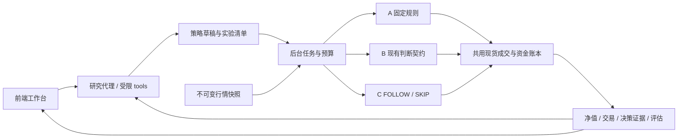

# Trading Swarm OKX：Horizon 风格研究工作台的后端与评估设计

更新：2026-09-21。本文同时区分**已经实现**和**后续扩展**。现有 5191 是原仓库的前端；本次代码在隔离副本实现，没有替换正在运行的 5191，没有修改在线策略或发出交易指令。

## 1. 结论与落地流程

应该接在现有 Trading Swarm 上，不必为了复现 Horizon 换掉整个交易系统。最有价值的变化是新增一个有版本、有证据、有预算的研究域，并让不同决策器使用同一套历史时钟和资金账本。

用户路径：**表达策略 → 确认可执行解释 → 选数据与预注册区间 → 估算预算 → A/B/C 回放 → 看差异与原因 → 提出可证伪修改 → 同条件再跑 → 验证集选择 → 一次留出检验 → 后续实时 paper 验证**。

其中“可执行解释”必须显式出现。例如“突破后有效回踩”含主观条件，不能直接拿“收盘突破前 20 根最高价”的代码充当完全相同的策略。当前首次实现采用 `donchian_close_long_v1`：收盘突破此前 N 根 high，成交量相对此前 N 根均量达标，ATR 止损，固定 R 目标，持有期上限。这是一个清楚、可复算的起点。

本次已经落地的闭环是现货、单资产、做多、单持仓。支持多个资产分别实验，不把它们的独立权益简单相加冒充组合。永续、卖空、跨资产共享保证金、限价队列、加仓和 live automation 在 capabilities 中明确不支持。

## 2. 为什么不直接在旧 backtest 上再画三条曲线

只读审计当前 `okx-devday` 工作树发现：

| 现有实现 | 对结论的影响 | 新路径的处理 |
|---|---|---|
| `backtest.ts` 已计算 net R，但账户权益与部分汇总仍按 gross R 更新 | 费用后的亏损可能仍显示为胜；代理看到偏高权益 | 8 位定点 cash / quantity / cost basis 账本，费用直接扣现金 |
| 代理读完收盘后，部分 EXIT/REDUCE 在同一 close 成交 | 决策与成交时序不一致 | 所有主动入场、退出、减仓都排到下一根 open |
| 已有 three legs 用空仓、固定账户逐点判断方向 | 属于候选级方向实验，不是持仓组合回测 | 每路独立 cash、position、pending、summary、每日计数 |
| 开跑/归因时可能重新读当前 workflow 或 strategy head | 同一 run 的含义会漂移 | run 创建时保存策略全文、版本、policy、playbook、模型身份 |
| 旧缓存键缺交易场所和市场；部分 funding 是 best effort | 不能保证重放同一数据或真实净成本 | 导入带 venue / market / source 的内容寻址快照；当前 spot 不需要 funding |

原有 Strategy Lab 的预注册、净 R、walk-forward、bootstrap 与多重检验能力值得复用。新接口没有把旧 ledger 的毛/净不同协议混算，也没有自动回写现有策略的 paper/live 资格。

## 3. 三类职责与四个 loop

### Loop 1：构建策略

1. 研究代理读取可用快照和预注册 study。
2. 把自然语言解释为受限 `ResearchPolicy`，明确方向、lookback、量比、ATR、目标 R、持有期。
3. `policies.create` 做 Schema 校验并保存内容哈希草稿；超出 DSL 的要求应该解释为暂不支持，不能只在描述里声称已经实现。
4. 前端让用户看到原文和结构化解释。规则之外的假设也显示：现货、市场单、下一 open、无加仓、固定半仓减仓。
5. 用完整 request 发起第一次 development 实验。模型工具不能直接跑留出集。

当前没有任意 Python/shell 工具。Horizon 录屏里的自由编写诊断脚本是值得扩展的能力，但现阶段用受限领域工具更容易保证权限、可复现性与前端契约。后续要放开代码，应该单独运行在无网络、只读输入、限制 CPU/内存/时间、限定输出目录的 worker，并记录源码、依赖镜像和执行日志。

### Loop 2：历史交易判断

同一份数据、同一时钟、同一执行规则，按以下顺序推进每根 K 线：

1. 处理已有保护单在 open 的跳空触发。
2. 执行上一根 close 产生的主动市场单。
3. 处理本根 high/low 触发的保护单；同根双触优先止损。无法知道 intrabar 具体时刻，标记 `intrabar_unknown`。
4. 扣费、更新剩余成本、持仓与现金，以 close 盯市。
5. 只交付已闭合且已可得的历史窗口给决策器。
6. 代码检查持有期限；到期时排队下一 open 退出。
7. 决策器判断，生成下一可执行事件的 pending action。
8. 保存决策哈希、原始模型调用、权益、费用、拒绝原因。

| 路径 | 当前实际实现 | 能回答的问题 |
|---|---|---|
| A `a_rules` | 明确 DSL 判断候选，代码固定 sizing/stop/target/horizon | 这一具体规则解释的历史表现 |
| B `b_agent` | 复用现有 `buildContext → judgeOnce → evaluateGates`；每个 close 扫描/复核；允许 market PROPOSE、HOLD、EXIT/INVALIDATE、固定半仓 REDUCE | 这套代理输入、判断和退出流程相对代码有什么变化 |
| C `c_filter` | 候选上输出 follow/skip；代码丢弃模型经济字段；仓位/保护/期限仍固定 | 候选筛选是否有增量价值 |

B 保留现有代理的主要契约，但不能称为完整线上系统重演：本版没有线上议会、信息员新闻、tick 快动、外部事件和跟单历史；不支持 limit/ADD；REDUCE 固定一半。需要这些因素时，应分别加适配器并形成新协议，不能悄悄改变旧 run 的含义。

C 在持仓期间也可对新候选给出 follow/skip，供候选级分析；账户若无空位则不能重复开仓，决策上记录 `position_capacity`。因此“follow 数量”不等于“实际成交次数”。期限退出由代码负责，不交给 C。

### Loop 3：诊断与修改

已实现的工具：

| tool | 权限和产物 |
|---|---|
| `datasets.list` | 只读快照元信息 |
| `studies.get` | 只读预注册分段和试验预算 |
| `policies.create` | 校验并保存策略 DSL 草稿；不激活 |
| `experiments.start` | 仅某 study 的第一次 development 实验 |
| `runs.list` | 实验状态、身份和指标 |
| `runs.metrics` | 净指标、调用次数、tokens、真实返回模型、错误与数据标记 |
| `runs.trades` | 分页退出明细、费用、数量、成交时序 |
| `runs.decisions` | 分页动作、输入哈希、候选与 gate 错误 |
| `runs.compare` | 同次 A/B/C 账户比较、候选结果和随机参与率对照 |
| `policy.draft` | 从已完成的 development 父实验生成差异草稿 |
| `experiments.run_candidate` | 在父实验条件上发起候选；最多改两个经济参数 |

候选工具固定父实验的数据、区间、执行设置和预算；沿用父实验的模型与 playbook。模型 CLI 配置变化会拒绝该父子比较。当前是**一轮研究调用可以诊断并提交一个新 job；job 完成后再进入下一轮**，不会在后台无限自我优化，也不会因等待一个 job 耗尽模型轮数。

研究 loop 最多 8 轮，有 120 秒调用时限。错误返回给代理修正；模型故障持久保存 failed 与已有 trace。只有拿到真实 job ID 和有效状态才显示已发起实验。研究输出、附件和 tool 结果作为数据处理，不能增加交易权限。

### Loop 4：验证与晋升

本次已实现：study 不可变；development / validation / holdout 分段；purge 间隔；持有期不能超过预注册 purge；完整区间执行；试验数统计包含失败与取消；启动一次 holdout 后 study 封存；研究代理不能自行开启 holdout。

目前没有自动选优、自动 walk-forward 执行或 paper/live 晋升。留出集仍可由用户通过显式 runs API 发起一次；该结果产生后应作为最终检验，不能再继续同 study 调参。用户创建新 study 或使用别的工具读过同一时期数据，系统无法证明其未被污染；跨 study 搜索记录仍需要上层研究登记。

最终晋升应该是：工程契约过关 → 历史 development 探索 → validation 选择 → 一次 holdout → 时间向前推进的 paper/shadow → 人工批准执行计划。上线时复用数据/决策协议和风险逻辑，订单只能进入既有 intent/execd 边界。新研究模块不连接任何交易写入口。

## 4. 账本、数据和身份

### 可复现身份

run manifest 保存 engine_version、adapter_version（含现有 prompt version）、完整 request、dataset hash、policy hash、source strategy 全文、brain kind/model/name/configuration hash、playbook、trial number、created_at 和 manifest hash。每个真实模型调用保存 system/user 原文与共同 prompt hash、返回模型、tokens、耗时、原文和错误。决策输入还有 account / position / previous_summary 和 input_hash。

已有记录的 replay 不调用模型，只按同输入哈希回放动作，重算权益与成交并比较结果哈希。重新调用同一模型不保证复现同样答案；temperature、seed 和模型权重版本是否可锁，取决于既有 CLI adapter。本版不会虚构这些保证。源码版本用发行补丁/提交和 engine/adapter version 关联；未来 CI 应把构建制品 digest 写入 manifest，避免手工版本号未更新。

### 数据边界

- 快照需要 venue、market、symbol、timeframe_ms、source、retrieved_at、完整 OHLCV。
- 当前要求 bars 严格连续、唯一、排序正确，`close_time=open_time+timeframe_ms-1`，`available_at=close_time`。
- 这是一种明确的 bar-close 可得假设；有发布延迟、修订或异步数据的输入会被拒绝，不是“已经支持所有双时间数据”。
- 高周期只由完整 UTC buckets 聚合；不会从 1h 虚构 15m。
- 不用今日 OI、新闻、名单和账户记忆补历史。
- 导入数据的 source 是声明，不是可信签名。本次没有新建交易所下载器。实际 OKX 数据应由现有只读行情/execd 导出后导入，保留原始响应、产品类型、分页区间、时区与数据哈希。
- 单币策略不等于无幸存者偏差：用户挑今天仍存在的币回看，已经做了一次选择。扩为选币策略时必须使用当时可交易 universe，包含退市币和上市时间。

### 成交与会计口径

金额、数量、价格对外用十进制字符串，对内用 8 位定点 BigInt；指标和统计使用 Number。数量向下取整到 qty_step；现金、单笔风险和名义分配共同限制仓位；不足最小名义直接不成交。risk_fraction 是基于止损价差的风险预算，跳空和费用仍可让最终亏损超过该数值。

买入价含不利滑点，卖出也含不利滑点；两边扣 fee_rate。分批退出按剩余成本、费用、风险分摊，最终退出用残值，避免小数舍入破坏现金守恒。`trades` 是退出批次，`position_id` 将它们连回同一持仓；closed_trades、win_rate、profit_factor 按完全平仓后的持仓聚合。尚未全平持仓不计入胜率，但其盯市盈亏和已扣费用计入总权益。

终点保留持仓并盯市，不看终点之后的数据，也不假造“读完最后 close 再同价卖出”。因此总收益可以包含未实现盈亏。maximum drawdown 是当前 bar-close 权益序列的回撤；不是 tick 级全路径回撤。仓位敞口按本版 close 采样。未来应增加更精细的订单/盘口模型、市场冲击和流动性容量限制。

## 5. Eval 必须做，而且要分层

“策略胜率”不应作为总评。实验对象实际是：**策略解释 × 代理及提示词版本 × 可见信息 × 风险与成交方式**。

| 层级 | 要检验的内容 | 失败意味着什么 |
|---|---|---|
| E0 工程正确性 | 未来哨兵、next-open、gap/双触、费用现金守恒、状态隔离、幂等、recorded replay、权限、预算 | 引擎/实验不可信，不能评价策略 |
| E1 规则与契约 | 规则解释精度、非法动作率、引用有效性、价格/数值来源、repair率、unsupported coverage | 代理或表达层偏离预期 |
| E2 经济表现 | 净收益、回撤、完整持仓胜率、PF、R、敞口、换手、成本、尾部、容量 | 策略是否有可交易的历史优势 |
| E3 代理增量 | A/B/C、同参与数量随机skip、退出贡献、模型重复、信号级与账户级分开 | 改善来自判断、执行差异还是少参与 |
| E4 泛化 | purged walk-forward、holdout、成本压力、参数邻域、跨 regime、模型版本迁移 | 优势是否只是特定样本拟合 |
| E5 上线 | forward paper、延迟/漏单/取消/对账、数据与模型漂移、kill switch | 离线优势是否能在真实时钟运行 |

本次实际已经实现 E0 的测试、部分 E1 适配校验、E2 基础净指标、E3 候选与随机控制、E4 的预注册分段/封存。完整 E1 语义标注集、E4 walk-forward runner/参数稳定性/成本压力批次以及 E5 forward paper 仍是后续工作。不能把“测试全过”显示成“策略有效”。

### 三路比较如何解释

1. A 和 B 都差：先查规则解释与成交，再考虑没有 edge；不能直接说模型不行。
2. A 好、B 差：查入场漏掉/误判、违约、退出过早、无效输出、数据缺口与持仓认知。
3. C 回撤更低：同时看平均敞口、实际成交数量、候选中 follow 与 skip 的净 R，再和相同 follow 数量的随机筛选比较。
4. B 好、A 差：可能是代理过滤/退出有效，也可能只是 B 实际执行了另一条策略。用逐笔差异解释，不能只看终值。
5. 训练期都好、留出期差：可能是过拟合、regime变化或多重搜索；不要再围绕留出集改提示。

C 的候选标签仅在回放结束后计算，不进入交易代理输入。标签要求完整的固定最大未来窗口，不能只保留“提前赢了、所以可结算”的尾部样本。候选用独立账户模拟，共享成本/保护规则；它不等于组合可实现利润。随机对照目前只匹配参与数量，尚未按时间、波动和方向分层，相关交易会削弱推断，所以标 `exploratory`。

### 统计与实验纪律

当前 bar-return 差值和候选 R 提供移动块 bootstrap，低于 30 样本给 insufficient；30 不是“够用了”的普适门槛。daily Sharpe 用完整内部 UTC 日的收益、365 天年化、零无风险利率；不足 30 日不显示估计。crypto 的肥尾、相关与短历史会让这些数不稳定。

已有 `replay-stats.ts` 的 anchoredWalkForward、effectiveReturns、deflatedSharpe 可作为下一阶段基础。但本版没有把旧 Lab 的等权 R 统计包装成真实资金组合的 DSR。要做严肃选优，应登记所有尝试，按同协议计算 trial Sharpe，报告 DSR/PSR、置信区间与参数邻域；不能用一个自动综合分数替代这些证据。

特别注意：只限制输入时间并不能消除 LLM 权重中的历史记忆。模型可能知道某日期的崩盘或某币的后续走势。可增加日期/资产匿名化的敏感性实验、不同知识截止期模型对照；最终需要使用决策产生之后才出现的未来 paper 结果。匿名化本身也会去掉有用语义，不是完整解决方案。

## 6. 对 Horizon 的学习与补强

| Horizon demo 可见能力 | 本版实现/交给前端 | 应补强的地方 |
|---|---|---|
| 对话旁边固定策略对象与 v1 | manifest/policy/source_ref + run IDs | 区分策略版本、代理版本、执行版本、数据版本 |
| “设置品种/定义信号/完成”阶段 | queued/running/progress/terminal 事件 | 标实际完成状态，不展示未经观测的假进度 |
| Overview/Performance/Trades | 净指标、权益、退出批次、决策与对照 | 一张图可定位到模型当时输入与规则 |
| agent 读表、写诊断脚本、修错 | 有限、可审计分析工具与错误修复 | 自由代码留给独立沙箱worker，不给线上交易权限 |
| 优化报告并启动重跑 | parent_run +最多两参数差异+新job | 假设、预计提升、实测提升分状态；失败不报成功 |
| proprietary score | 不复刻未知公式 | 用证据完整度、样本充分性、净效果和泛化分开展示 |
| Automate | 本版 capabilities 明确关闭 | 后续走原有 intent/execd + forward paper，而非从报告直接下单 |

录屏 B 只显示了诊断和重建开始，没有展示优化 v2 完成结果，不能据此认定 Horizon 做出了真实样本外改善。原解构报告还讨论了“剔除被止损交易后看幸存者表现”“更低胜率但更高盈亏比”“空闲资金与平均敞口混用”等容易误导的诊断。本版把条件样本、候选结果和资金组合分开展示，是应超越的核心。

## 7. 工程模块与下一阶段顺序

当前新增路径在 gateway 的 `demo/research/`：primitives（Schema/哈希/定点数）、ledger（成交资金）、engine（历史时钟与A/B/C）、agent（原代理适配与预算）、evaluation（事后标签与控制）、store（SQLite快照/实验/事件/调用）、service（后台任务/取消/replay）、tools（研究loop）。HTTP 通过既有 extraRouteModules 接入。

当前单 gateway 进程、单 research job。重启会把未完任务标 interrupted，保存已完成的模型调用，不自动重调用产生额外费用；不是 checkpoint-resume。行情最大 50,000 bars，单次回放区间最多 10,000 bars，输入窗口最多 5,000 bars，决策记录最多 32 MiB，HTTP body 最大 20 MiB。记录预算耗尽会终止为不完整实验；列表使用轻量摘要，避免加载全部决策记录。运行列表显示最近 100 个，但 study 权限使用数据库完整查询，不使用 UI 分页集合。

建议后续按收益最大顺序推进：

1. **可信 OKX 行情导入与真实首条策略**：从已有只读服务导出，固定 venue/symbol/category，走一轮真实模型 A/B/C；先少量时点检查每一条模型证据，不直接跑多年。
2. **证据和交易明细前端**：前端按接口文档连接；所有曲线绑定run，改变设置生成新run。
3. **语义 eval 标注集**：50–100 个边界案例起步，覆盖趋势/震荡、数据不足、已有持仓、跳空、矛盾信号；人工标签区分必守规则与可自由裁量。
4. **自动化研究批次**：有预算的成本压力、参数邻域、walk-forward、配对重复；持续登记trial，禁止用holdout反复修prompt。
5. **更多解释器和可组合DSL**：复用现有 SIGNAL_REGISTRY，但每个 family 声明其解释版本与未覆盖语义。对突破→回踩→确认等序列用显式状态机、过期和reset。
6. **组合和永续**：多标的同一时钟、共享现金/风险、同时信号排序、相关暴露、合约乘数、mark/index/last、funding实际事件、保证金和强平。缺数据时 fail-closed 或分成仅毛收益研究协议，不能伪装净实盘回测。
7. **forward paper 与漂移监测**：统一 DecisionInput/DecisionOutput 和风险配置，保持research权限与execution权限分离；后续再审批上线。

后端基础已可独立运行并供前端联调；生产化完整跨市场量化平台仍需上述数据/执行/统计扩展。不要在 UI 把未实现的项目做成看似可点的功能。

## 8. 调研依据

- Horizon 官方描述自然语言策略、回测与执行流程：[How Horizon works](https://docs.horizon.trade/concepts/how-it-works)。公开说明不能证明其私有工具/评分实现。
- QuantConnect 的时间切片模型强调按数据时间推进事件：[Timeslices](https://www.quantconnect.com/docs/v2/writing-algorithms/key-concepts/time-modeling/timeslices)。本版借鉴已知信息边界，额外冻结可得时间假设。
- NautilusTrader 描述事件驱动 backtesting 和共用运行组件：[Backtesting](https://nautilustrader.io/docs/latest/concepts/backtesting/)。借鉴共用接口原则，不表示本项目已经采用该引擎。
- Freqtrade 提供基于切片重算检测前视的方法：[Lookahead analysis](https://docs.freqtrade.io/en/stable/lookahead-analysis/)。下一阶段应增加策略特征完整序列与截断序列的一致性测试。
- Bailey / López de Prado 讨论大量尝试和非正态收益对 Sharpe 的影响：[Deflated Sharpe Ratio](https://doi.org/10.2139/ssrn.2460551)。需要搜索登记，不只是最大化一次回测 Sharpe。
- LLM 历史评估还可能遇到训练记忆泄漏；应结合真实时间向前验证：[Time Travel is Cheating](https://arxiv.org/abs/2505.11065)。这是研究依据，不是对当前某个模型已泄漏的断言。
